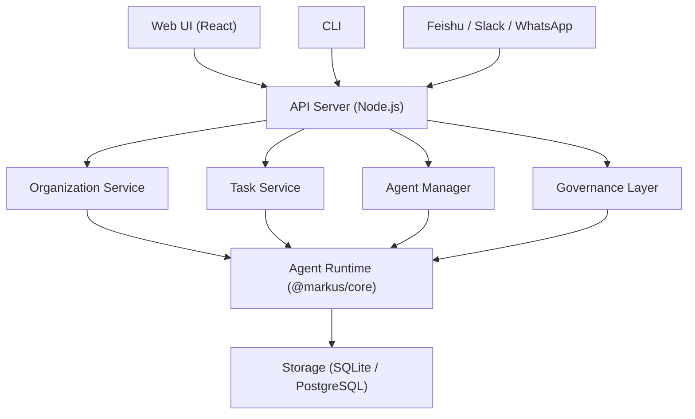

# Markus

**AI Native Digital Employee Platform** -- Build and manage autonomous AI teams that truly work, not just chat.

[](#)
[](LICENSE)
[](https://nodejs.org/)
[](https://www.typescriptlang.org/)

[English](README.md) | [中文](README.zh-CN.md)

---

## What is Markus?

Existing AI assistants are **personal tools** -- one person, one chatbot. Markus is an **organizational platform** -- one organization, N digital employees working together.

|  | Personal AI Assistants | Markus |
|---|---|---|
| **Scope** | Individual productivity | Organization-wide |
| **Behavior** | Reactive (you ask, it answers) | Proactive (heartbeat-driven autonomous work) |
| **Environment** | Shared host machine | Isolated workspace per agent |
| **Management** | Edit config files | Hire / onboard / review lifecycle |
| **Tasks** | CLI/API only | CLI + API + Web UI + kanban boards |
| **Collaboration** | Single agent | Multi-agent teams with governance |

## Key Features

- **Autonomous AI Agents** -- Digital employees with roles, skills, memory, and proactive heartbeat behaviors
- **Multi-Agent Teams** -- Organize agents into teams with managers, workers, and human members
- **Task Governance** -- Approval workflows, progressive trust levels, workspace isolation, formal delivery review
- **Project Management** -- Projects with iterations, kanban boards, and automated reporting
- **Knowledge System** -- Three-tier memory (session / daily log / long-term) plus shared knowledge base
- **Communication Hub** -- Web UI chat, Smart Route, channels, plus Feishu/Slack/WhatsApp adapters
- **Agent-to-Agent Protocol** -- Agents collaborate via structured A2A messaging
- **Tool Ecosystem** -- Shell, files, git, web search, code search, MCP integration, GUI automation
- **Skill Marketplace** -- Install and share agent skills and templates

## Quick Start

### Prerequisites

- Node.js >= 20
- pnpm >= 9
- An LLM API key (OpenAI, Anthropic, or DeepSeek)

### Install & Run

```bash
git clone https://github.com/markus-global/markus.git
cd markus
pnpm install
pnpm build

# Configure your API key
cp .env.example .env
# Edit .env and set at least one LLM API key

# Start everything (API + Web UI)
pnpm dev
```

Open **http://localhost:3000** in your browser. Login with `admin@markus.local` / `markus123` (you'll be prompted to change the password on first login).

The API server runs on `http://localhost:3001`.

<details>
<summary>Docker Compose</summary>

```bash
cd deploy
cp ../.env.example .env
# Edit .env with your API keys
docker compose up -d
```

</details>

## Architecture

Markus is a TypeScript monorepo with the following packages:

```
packages/
  shared/        Shared types, constants, utilities
  core/          Agent runtime engine
  storage/       Database schema + repository layer (SQLite / PostgreSQL)
  org-manager/   Organization management + REST API + governance
  comms/         Communication adapters (Feishu, Slack, WhatsApp)
  a2a/           Agent-to-Agent protocol
  gui/           GUI automation (VNC + OmniParser)
  web-ui/        Web management interface (React + Vite + Tailwind)
  cli/           CLI entry point + service assembly
```



For the full architecture documentation, see [docs/ARCHITECTURE.md](docs/ARCHITECTURE.md).

## Documentation

| Document | Description |
|----------|-------------|
| [Architecture](docs/ARCHITECTURE.md) | System design, package structure, core concepts |
| [User Guide](docs/GUIDE.md) | Setup, configuration, Web UI usage, FAQ |
| [API Reference](docs/API.md) | REST API endpoints and WebSocket events |
| [Contributing](CONTRIBUTING.md) | Development setup, code style, PR process |

All docs are available in [English](docs/ARCHITECTURE.md) and [Chinese](docs/ARCHITECTURE.zh-CN.md).

## Contributing

We welcome contributions! Please read [CONTRIBUTING.md](CONTRIBUTING.md) for development setup, code conventions, and PR guidelines.

```bash
# Development workflow
pnpm install
pnpm build
pnpm dev        # Start dev server
pnpm test       # Run tests
pnpm typecheck  # Type check
pnpm lint       # Lint
```

## License

Markus is dual-licensed:

- **Open Source**: [AGPL-3.0](LICENSE) -- free for self-hosting, personal use, and community contributions
- **Commercial**: [Available](LICENSE-COMMERCIAL.md) for SaaS deployments and proprietary modifications

Agent templates and skills shared through the marketplace may use their own licenses (typically MIT).

## Community

- [GitHub Issues](https://github.com/markus-global/markus/issues) -- Bug reports and feature requests
- [GitHub Discussions](https://github.com/markus-global/markus/discussions) -- Questions and ideas
