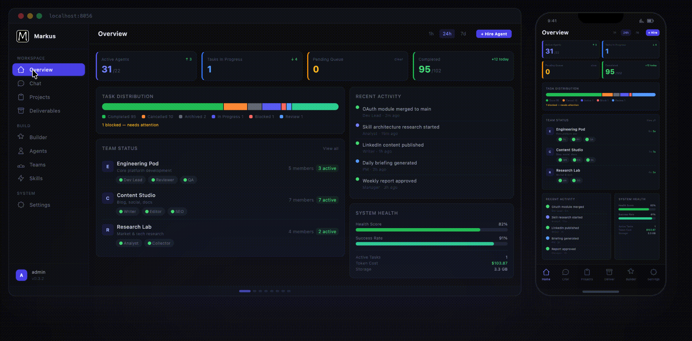

<p align="center">
  
</p>

<h1 align="center">Markus</h1>

<p align="center"><strong>AI teams that actually deliver.</strong></p>

<p align="center">
  The open-source AI workforce platform. Developers, researchers, writers, analysts &mdash;<br>
  an AI team that runs around the clock at a fraction of the cost.
</p>

<p align="center">
  <a href="https://github.com/markus-global/markus/actions/workflows/ci.yml">
    
  </a>
  <a href="https://github.com/markus-global/markus/releases">
    
  </a>
  <a href="https://github.com/markus-global/markus/stargazers">
    
  </a>
  <a href="https://github.com/markus-global/markus/blob/main/LICENSE">
    
  </a>
  <a href="https://github.com/markus-global/markus/issues">
    
  </a>
</p>

<p align="center">
  <a href="https://www.markus.global">Website</a> &middot;
  <a href="docs/GUIDE.md">Docs</a> &middot;
  <a href="https://github.com/markus-global/markus/discussions">Discussions</a> &middot;
  <a href="CONTRIBUTING.md">Contributing</a>
</p>

<p align="center">
  <strong>English</strong> | <a href="README.zh-CN.md">中文</a>
</p>

<p align="center">
  
</p>

---

## What is Markus?

Markus is an **open-source platform that runs complete AI teams** — not a wrapper around someone else's agents. You define roles (developer, reviewer, researcher, writer, analyst, ops), assign work, and Markus handles the rest: task breakdown, delegation, parallel execution, quality review, and delivery.

Unlike agent orchestrators that dispatch tasks to external CLI tools, **Markus includes the full agent runtime**. Each agent talks directly to LLM APIs, uses built-in tools (shell, files, git, web search, code analysis, MCP), maintains five layers of persistent memory, and operates proactively through heartbeats — even when you're not watching.

**Deploy it on a cloud server and manage your entire AI company from your phone.** The responsive web UI works on desktop and mobile — check progress, review deliverables, and chat with agents from anywhere.

**Zero config to get started.** No Docker. No PostgreSQL. No Go compiler. One command, and your AI workforce is running.

---

## Quick Start

```bash
# Install
curl -fsSL https://markus.global/install.sh | bash
# or: npm install -g @markus-global/cli

# Launch
markus start
```

Open **http://localhost:8056** — log in with `admin@markus.local` / `markus123`.

That's it. SQLite database, bundled web UI, zero dependencies to install separately.

> **From source:** `git clone https://github.com/markus-global/markus.git && cd markus && pnpm install && pnpm build && pnpm dev`

---

## How It Works

### 1. Describe what you need

Tell the built-in Secretary agent your goal in plain language. It assembles the right team, breaks down requirements into tasks, and sets up the project.

> *"I need a research team to scan competitor products, write a competitive analysis, and draft a go-to-market strategy."*

### 2. Agents execute in parallel

Agents delegate, spawn subagents, review each other's work, and escalate only when they should. Each agent works in an isolated workspace with its own context. Developers write code in Git worktrees; researchers compile findings; writers produce drafts — all at the same time.

### 3. Review and deliver

You review the final deliverables — not the process. Every output passes through quality gates. The full audit trail shows exactly what each agent did and when.

---

## Key Features

### Autonomous Agent Runtime
Each agent is a full LLM-powered worker with built-in tools — shell, file I/O, git, web search, code analysis, and any MCP server. Agents execute work directly; they don't proxy to external CLI tools. Works with **any LLM provider**: Anthropic, OpenAI, Google, DeepSeek, MiniMax, Ollama, and more, with automatic failover.

### Five-Layer Memory
Session context, structured memories, daily logs, long-term knowledge (`MEMORY.md`), and agent identity (`ROLE.md`). Context stays structured and useful across restarts, not just within a single conversation.

### Proactive Heartbeat
Agents don't just wait for instructions. The heartbeat scheduler drives periodic check-ins — patrol open tasks, process background completions, surface blockers. Your team works while you sleep.

### Team Collaboration & A2A
Role-based architecture with managers and workers. Agents delegate tasks, send structured messages, and collaborate through a built-in Agent-to-Agent protocol. Subagent spawning lets any agent split work into lightweight parallel workers.

### Governance & Trust
Progressive trust levels (probation, standard, trusted, senior) control what agents can do autonomously. Formal submit-review-merge delivery. Emergency stop, pause-all, and announcement broadcasts. Full audit trail for every action.

### Communication Bridges
Smart routing across channels, DMs, and external platforms. Native bridges to Slack, Feishu, WhatsApp, and Telegram — agents meet your team where they already talk.

### Skills Marketplace
Browse and install agent templates, team configurations, and reusable skills from the Markus Hub. Share what works with the community.

### Manage from Anywhere
Deploy on any cloud server and run your AI company from your phone. The fully responsive dashboard works on desktop and mobile — real-time KPI tiles, task distribution, team status, activity feeds, execution timelines with streaming logs. Review deliverables on the train. Approve tasks from the couch. Your workforce never stops, and neither does your visibility.

---

## Why Not Just Use a Single AI Agent?

A single agent — Claude Code, Codex, ChatGPT, or any copilot — is great at executing one task at a time. But one employee doesn't make a company. Single agents don't:

- **Coordinate** — they can't delegate subtasks to other agents or track dependencies
- **Remember** — context evaporates when the session ends
- **Operate proactively** — they wait for your prompt, every time
- **Review each other** — there's no quality gate between "agent said done" and "actually done"
- **Scale** — running 10 agents means 10 windows with zero shared visibility

Markus is the organizational layer. Roles, teams, task boards, reviews, governance, persistent memory, and a dashboard that shows what every agent is doing — across development, research, writing, operations, and anything else you throw at them. You manage a workforce, not individual prompts.

---

## Architecture

```
┌─────────────────────────────────────────────────────────┐
│                     Web UI (React)                      │
│       Dashboard · Chat · Projects · Builder · Hub       │
└──────────────────────┬──────────────────────────────────┘
                       │ REST + WebSocket
┌──────────────────────┴──────────────────────────────────┐
│                  Org Manager (API Server)               │
│     Auth · Tasks · Governance · Projects · Reports      │
└──────────────────────┬──────────────────────────────────┘
                       │
┌──────────────────────┴──────────────────────────────────┐
│                  Agent Runtime (Core)                   │
│  Agent · LLM Router · Tools · Memory · Heartbeat · A2A  │
└──────────┬────────────────────────────┬─────────────────┘
           │                            │
┌──────────┴──────────┐    ┌────────────┴─────────────────┐
│  Storage (SQLite /  │    │  Comms (Slack, Feishu,       │
│   PostgreSQL)       │    │   WhatsApp, Telegram)        │
└─────────────────────┘    └──────────────────────────────┘
```

TypeScript monorepo with modular packages:

| Package | Role |
|---------|------|
| **core** | Agent runtime — LLM routing, tools, memory, heartbeat, workspace isolation |
| **org-manager** | REST API, WebSocket, governance, task lifecycle |
| **web-ui** | React + Vite + Tailwind dashboard |
| **storage** | SQLite (default) / PostgreSQL persistence via Drizzle |
| **cli** | `@markus-global/cli` — one-command install and launch |
| **a2a** | Agent-to-Agent communication protocol |
| **comms** | External platform bridges |
| **shared** | Shared types, constants, utilities |

---

## Documentation

| Guide | Description |
|-------|-------------|
| [User Guide](docs/GUIDE.md) | Setup, configuration, Web UI walkthrough |
| [Architecture](docs/ARCHITECTURE.md) | System design, agent runtime, memory, governance |
| [Memory System](docs/MEMORY-SYSTEM.md) | Five-layer memory deep dive |
| [API Reference](docs/API.md) | REST API endpoints |
| [Contributing](CONTRIBUTING.md) | Development setup, PR process |

---

## Contributing

```bash
pnpm install && pnpm build
pnpm dev          # API + Web UI in dev mode
pnpm test         # Run tests
pnpm typecheck    # TypeScript check
pnpm lint         # ESLint
```

Looking for a way to contribute?
- [Good first issues](https://github.com/markus-global/markus/labels/good%20first%20issue) — Beginner-friendly tasks
- [Help wanted](https://github.com/markus-global/markus/labels/help%20wanted) — Features the community needs
- [Bug reports](https://github.com/markus-global/markus/issues) — Help us fix issues

See [CONTRIBUTING.md](CONTRIBUTING.md) for full guidelines.

---

## License

Markus is dual-licensed:

- **Open Source**: [AGPL-3.0](LICENSE) — Free for self-hosting and community contributions
- **Commercial**: [Available](LICENSE-COMMERCIAL.md) — For SaaS deployments and proprietary modifications

Agent templates and skills shared through the marketplace may use their own licenses (typically MIT).

---

<p align="center">
  <a href="https://www.markus.global">Website</a> &middot;
  <a href="https://github.com/markus-global/markus/discussions">Discussions</a> &middot;
  <a href="https://github.com/markus-global/markus/issues">Issues</a>
</p>

<p align="center">
  <sub>Markus — Where AI Agents Work as a Team</sub>
</p>
