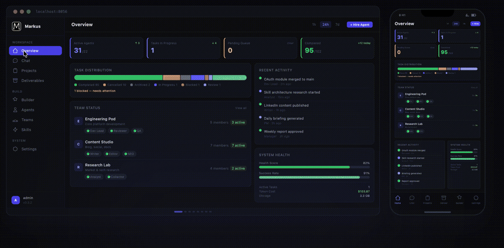

<p align="center">
  
</p>

<h1 align="center">Markus</h1>

<p align="center">
  <strong>The open-source AI workforce platform.</strong><br />
  One AI agent is a smart intern who forgets everything and says “done” too early.<br />
  Markus gives your agents memory, peers, reviews, and a 24/7 heartbeat — so work actually ships.
</p>

<p align="center">
  <a href="https://github.com/markus-global/markus/actions/workflows/ci.yml">
    
  </a>
  <a href="https://github.com/markus-global/markus/releases">
    
  </a>
  <a href="https://github.com/markus-global/markus/stargazers">
    
  </a>
  <a href="https://github.com/markus-global/markus/blob/main/LICENSE">
    
  </a>
  <a href="https://github.com/markus-global/markus/issues">
    
  </a>
</p>

<p align="center">
  <a href="https://www.markus.global"><strong>Website</strong></a> ·
  <a href="https://markus.global/blog">Blog</a> ·
  <a href="docs/GUIDE.md">Documentation</a> ·
  <a href="https://github.com/markus-global/markus/discussions">Discussions</a> ·
  <a href="CONTRIBUTING.md">Contributing</a> ·
  <a href="docs/COMMUNITY.md">Community</a>
</p>

<p align="center">
  <strong>English</strong> | <a href="README.zh-CN.md">中文</a>
</p>

<p align="center">
  
</p>

---

## The 60-Second Pitch

**Markus is the organizational layer your AI agents are missing.**

You know single-agent copilots: great at one task, useless as an organization. They forget your decisions between sessions, stall on a blocker with nobody to ask, and — worst of all — they call their own work “done.”

Markus changes the operating model. You describe a goal in plain language; Markus assembles a team of role-based agents (researcher, developer, reviewer, writer, ops), breaks the work into tasks, runs specialists in parallel, and makes every delivery pass through peer review before it reaches you. Your team keeps working while you sleep.

- **A team, not a wrapper** — a complete agent runtime built in. Every worker talks to LLM APIs directly and uses built-in tools: shell, file I/O, git, web search, code analysis, GUI & browser automation, and any MCP server. No proxying through external CLIs.
- **Zero config to start** — SQLite storage, bundled web UI, one command. From install to a running AI team in about **10 minutes**.
- **Works 24/7** — heartbeat scheduling keeps agents moving, reviewing, and escalating without a human in the loop.
- **Runs anywhere** — your laptop, a small cloud VM, or your datacenter. Desktop app for macOS / Windows / Linux, plus a responsive dashboard for your phone.

---

## 🚀 Quick Start — a working AI team in ~10 minutes

**1. Install** — pick whichever path is easiest:

```bash
# Desktop app (macOS / Windows / Linux)
#   → download from https://github.com/markus-global/markus/releases/latest

# npm (Node.js 22+)
npm install -g @markus-global/cli

# Linux one-liner (works without Node.js)
curl -fsSL https://markus.global/install.sh | bash
```

**2. Launch**

```bash
markus start
```

**3. Open** [http://localhost:8056](http://localhost:8056) — the onboarding wizard sets up your account (initial login: `admin@markus.local` / `markus123`).

**4. Tell your Secretary what you need**

> *“I need a research team: scan our competitors, write a competitive analysis, and draft a go-to-market strategy.”*

Markus assembles the team, breaks the goal into tasks, and starts executing — specialists in parallel, every delivery reviewed.

**That's it.** SQLite database, bundled web UI, zero external dependencies. From source: `git clone` → `pnpm install && pnpm build && pnpm dev`.

---

## 💼 What You Can Run on Markus

| Area | Example |
|------|---------|
| **Research & analysis** | Scan competitor products, compile a competitive analysis, draft a go-to-market strategy |
| **Software engineering** | Build a feature end-to-end — requirements, code, tests — with built-in peer review |
| **Content & publishing** | Draft, edit, review, and schedule articles, reports, and social posts |
| **Operations** | Daily briefings, issue triage, scheduled monitoring, blocker escalation |
| **Data & reporting** | Pull data, analyze it, and deliver finished reports on a schedule |
| **Personal research** | Deep-dive any topic and get a structured, cited deliverable back |

The same team keeps working after you close the laptop — heartbeats keep agents moving while you sleep.

---

## Why a Team Beats a Copilot

A single agent — Claude Code, Codex, ChatGPT, or any copilot — is great at executing one task at a time. But one employee doesn't make a company.

| | Single AI agent | Markus AI team |
|---|---|---|
| **Scale** | One task at a time | Parallel work across specialist roles |
| **Memory** | Context evaporates when the session ends | Three-layer persistent memory, auto-consolidated between sessions |
| **Initiative** | Waits for your prompt, every time | Heartbeat patrols tasks 24/7 — works while you sleep |
| **Quality** | “Done” is self-reported | Peers review, catch mistakes, and gate every delivery |
| **Visibility** | 10 agents = 10 windows | One dashboard, one audit trail |
| **Accountability** | No guardrails | Progressive trust levels, submit–review–merge, emergency pause |

You manage a workforce, not individual prompts.

---

## 🏛️ What Makes It an Organization, Not a Script

- **🧠 Three-layer memory** — procedural (how to do things), semantic (what it knows), episodic (what happened). Knowledge accumulates across sessions and consolidates automatically — your team gets measurably smarter the longer it runs.
- **⏰ Heartbeat-driven initiative** — agents don't wait to be prompted. The heartbeat scheduler patrols open tasks, processes async completions, and surfaces blockers — work keeps shipping after you close the laptop.
- **🛡️ Progressive trust levels** — probation → standard → trusted → senior. Agents earn scope and authority as they demonstrate reliability.
- **✅ Quality gates** — a formal submit → review → merge lifecycle. Nothing reaches you unreviewed; peers catch what self-reporting misses.
- **📜 Full audit trail** — every action is logged: who, what, when, and why. Reproduce results or investigate incidents without guessing.

---

## 🔒 Security & Data Ownership

- **Self-hosted, data yours** — runs entirely on your infrastructure. SQLite by default, PostgreSQL supported. No mandatory cloud, no data leaving your network unless you choose remote access.
- **Isolated workspaces** — each agent works in its own sandboxed workspace on the project branch; no cross-talk between runs.
- **Least privilege** — trust levels gate what agents can touch; imported skills map their declared permissions (`allowed-tools` → `requiredPermissions`) instead of running with blanket access.
- **Audit & control** — full action log, emergency pause, and human approval gates for high-stakes steps.
- **Bring your own keys** — connect any LLM provider; credentials live in your deployment, never in a third-party cloud.
- **Optional remote access** — Cloudflare Tunnel, Tailscale, FRP, or ngrok if you want to manage your team from anywhere.

---

## 🌍 Not Another Closed Ecosystem

Markus plays well with the AI ecosystem you already use — it doesn't ask you to start over.

- **80,000+ community skills, plug and play** — `markus skill import <path>` auto-detects and normalizes skills from **skills.sh / Claude Code, SkillHub / ClawHub, OpenClaw, SOUL.md, AgentScope, and MCP servers** into native Markus skills. No rewriting, no lock-in.
- **Export back** — `markus skill export <name> --format claude` renders your best skills into external standards so you can publish them back to skills.sh, SkillHub, OpenClaw, and beyond.
- **Import from inside a conversation** — agents can load a local skill package via `discover_tools({ mode: "import" })` and use it immediately, no restart.
- **Any MCP server** — standard MCP servers plug straight into the agent tool layer.
- **Any LLM provider** — Anthropic, OpenAI, Google, DeepSeek, MiniMax, Ollama, OpenRouter, SiliconFlow, Moonshot — with automatic failover and per-task routing.

> Full details: [Skill Ecosystem Adapter](docs/SKILL-ECOSYSTEM.md)

---

## 🏆 Real Teams on Markus

### Case: we dogfood Markus to build Markus

The Markus project itself runs on Markus. The skill-ecosystem adapter, the dual-license migration, and even this README went through the same pipeline we ship to you: requirements → tasks → parallel agents → peer review → merge, every step auditable. When the release train moves fast, discipline comes from the platform, not from memory.

### Your story could be here

Used Markus to ship a product, run a research sprint, or automate an operation? Tell us about it in [Discussions](https://github.com/markus-global/markus/discussions) — the best case studies get featured here and on our [blog](https://markus.global/blog). Quoted testimonials are always with permission.

---

## Architecture

```
┌─────────────────────────────────────────────────────────┐
│              Web UI (React) · Desktop (Electron)        │
│      Dashboard · Chat · Projects · Builder · Hub        │
└──────────────────────┬──────────────────────────────────┘
                       │ REST + WebSocket
┌──────────────────────┴──────────────────────────────────┐
│                  Org Manager (API Server)               │
│     Auth · Tasks · Governance · Projects · Reports      │
└──────────────────────┬──────────────────────────────────┘
                       │
┌──────────────────────┴──────────────────────────────────┐
│                  Agent Runtime (Core)                   │
│  Agent · LLM Router · Tools · Skills · Memory · A2A     │
└──────────┬────────────────────────────┬─────────────────┘
           │                            │
┌──────────┴──────────┐    ┌────────────┴─────────────────┐
│  Storage (SQLite /  │    │  Comms (Slack, Feishu,       │
│   PostgreSQL)       │    │   WhatsApp, Telegram)        │
└─────────────────────┘    └──────────────────────────────┘
```

TypeScript monorepo with modular packages:

| Package | Role |
|---------|------|
| **core** | Agent runtime — LLM routing, tools, skills, memory, heartbeat, workspace isolation |
| **org-manager** | REST API, WebSocket, governance, task lifecycle |
| **web-ui** | React + Vite + Tailwind dashboard |
| **desktop** | Electron desktop app (macOS / Windows / Linux) |
| **cli** | `@markus-global/cli` — one-command install and launch |
| **storage** | SQLite persistence (zero external dependencies) |
| **gui** | GUI automation — VNC, screenshots, input control, visual analysis |
| **comms** | Slack / Feishu / WhatsApp / Telegram bridges |
| **a2a** | Agent-to-Agent communication protocol |
| **remote** | Remote access — tunnels and zero-config networking |
| **chrome-extension** | Browser automation via the Markus extension |
| **shared** | Shared types, constants, utilities |

---

## Documentation

| Guide | Description |
|-------|-------------|
| [User Guide](docs/GUIDE.md) | Setup, configuration, Web UI walkthrough |
| [Architecture](docs/ARCHITECTURE.md) | System design, agent runtime, memory, governance |
| [Agent Runtime](docs/AGENT-RUNTIME.md) | Agent lifecycle, execution model, workspace isolation |
| [Tool System](docs/TOOL-SYSTEM.md) | Built-in tools, MCP integration, tool contracts |
| [Skill Ecosystem](docs/SKILL-ECOSYSTEM.md) | Import/export skills from skills.sh, SkillHub, OpenClaw, AgentScope, MCP |
| [Memory System](docs/MEMORY-SYSTEM.md) | Three-layer memory architecture (Tulving) |
| [Cognitive Architecture](docs/COGNITIVE-ARCHITECTURE.md) | Cognitive Preparation Pipeline (CPP) design |
| [Mailbox System](docs/MAILBOX-SYSTEM.md) | Agent attention model, priority queue, triage |
| [Prompt Engineering](docs/PROMPT-ENGINEERING.md) | System prompt assembly, tool loop, compression |
| [State Machines](docs/STATE-MACHINES.md) | Task & requirement FSM specification |
| [API Reference](docs/API.md) | REST API endpoints and WebSocket events |
| [Coding Tools](docs/CODING-TOOLS.md) | Claude Code / Codex / Cursor integration |
| [Learning Loop](docs/LEARNING-LOOP.md) | Agent self-improvement and memory consolidation |
| [Remote Access](docs/REMOTE-ACCESS.md) | Cloudflare Tunnel, Tailscale, FRP, ngrok setup |
| [Release & Distribution](docs/RELEASE-AND-DISTRIBUTION.md) | Build, packaging, publishing pipeline |
| [Blog](https://markus.global/blog) | Articles and tutorials on Markus and AI agents |

---

## 💬 Community

- **GitHub Discussions** — questions, show & tell, and case studies: <https://github.com/markus-global/markus/discussions>
- **Blog** — tutorials and product updates: <https://markus.global/blog>
- **Discord** — real-time chat with users and contributors (English/global) — *coming soon*
- **微信群** — 中文用户交流群，获取帮助、内测与贡献支持（建设中）

Join details, channel map, and the contributor escalation path are in [docs/COMMUNITY.md](docs/COMMUNITY.md). All channels follow our [Code of Conduct](CODE_OF_CONDUCT.md).

---

## Contributing

```bash
pnpm install && pnpm build
pnpm dev          # API + Web UI in dev mode
pnpm test         # Run tests
pnpm typecheck    # TypeScript check
pnpm lint         # ESLint
```

Looking for a way to contribute?

- [Good first issues](https://github.com/markus-global/markus/labels/good%20first%20issue) — beginner-friendly tasks
- [Help wanted](https://github.com/markus-global/markus/labels/help%20wanted) — features the community needs
- [Bug reports](https://github.com/markus-global/markus/issues) — help us fix issues

See [CONTRIBUTING.md](CONTRIBUTING.md) for full guidelines.

---

## License

Markus is dual-licensed:

- **Open Source**: [Apache-2.0](LICENSE) — free to use, modify, distribute, and self-host for any purpose, including commercial use
- **Commercial**: [Available](LICENSE-COMMERCIAL.md) — for teams needing enterprise support, indemnification, OEM embedding, or custom terms

Skills shared through the marketplace may use their own licenses (typically MIT).

---

<p align="center">
  <a href="https://www.markus.global">Website</a> ·
  <a href="https://markus.global/blog">Blog</a> ·
  <a href="https://github.com/markus-global/markus/discussions">Discussions</a> ·
  <a href="https://github.com/markus-global/markus/issues">Issues</a>
</p>

<p align="center">
  <sub>Markus — Where AI Agents Work as a Team</sub>
</p>