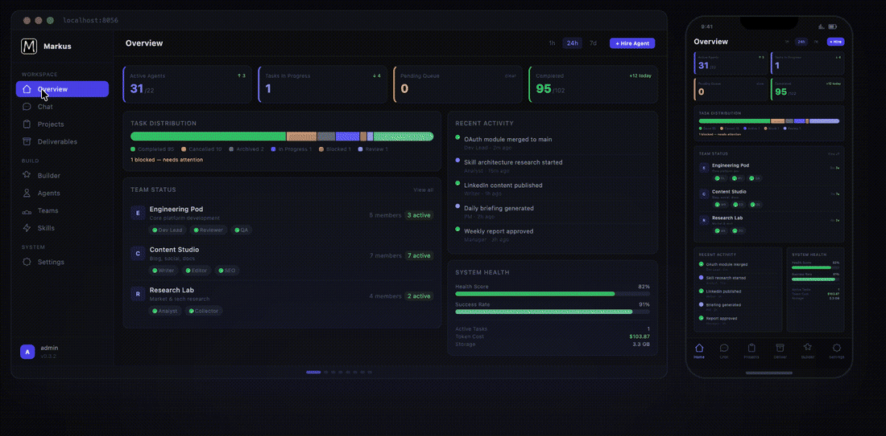

<p align="center">
  
</p>

<h1 align="center">Markus</h1>

<p align="center">
  <strong>An open-source AI team that ships while you sleep.</strong><br />
  You give it a goal in plain language. It hires the team, splits the work, runs<br />
  everyone in parallel, reviews every delivery, and keeps going while you rest.<br />
  <em>And yes — it built itself.</em>
</p>

<p align="center">
  <a href="https://github.com/markus-global/markus/actions/workflows/ci.yml">
    
  </a>
  <a href="https://github.com/markus-global/markus/releases">
    
  </a>
  <a href="https://github.com/markus-global/markus/stargazers">
    
  </a>
  <a href="https://github.com/markus-global/markus/blob/main/LICENSE">
    
  </a>
  <a href="https://github.com/markus-global/markus/issues">
    
  </a>
</p>

<p align="center">
  <strong>English</strong> | <a href="README.zh-CN.md">中文</a>
</p>

<p align="center">
  
</p>

---

> **🪞 Dogfooded into existence.** The Markus project is built *on* Markus: issues, tasks, code,
> reviews, releases — our own agent team runs the entire loop on itself, start to finish.
> If it can ship itself, it can ship whatever you're building.

---

## TL;DR

- **Not a wrapper** — agents talk to LLM APIs directly and use real tools: shell, files, git, web search, code analysis, GUI & browser automation, any MCP server.
- **Ships 24/7** — a heartbeat keeps the team moving, reviewing, and escalating. You sleep; they ship.
- **Memory that compounds** — three-layer persistent memory, auto-consolidated between sessions. The team gets measurably smarter the longer it runs.
- **Your data, your machine** — fully self-hosted. SQLite by default (PostgreSQL supported), zero mandatory cloud, zero lock-in.

---

## Intern → Company

A single copilot is a smart intern: great at one task, forgets everything overnight, and calls its own work "done." One employee doesn't make a company.

| | Single copilot | Markus team |
|---|---|---|
| **Scale** | One task at a time | Parallel work across specialist roles |
| **Memory** | Evaporates when the session ends | Persistent, auto-consolidated |
| **Initiative** | Waits for your prompt | Heartbeat patrols tasks 24/7 |
| **Quality** | "Done" is self-reported | Peers review and gate every delivery |
| **Visibility** | N tabs, N windows | One dashboard, one audit trail |

---

## 🚀 Start in ~10 minutes

```bash
# Desktop app (macOS / Windows / Linux)
#   → https://github.com/markus-global/markus/releases/latest

npm install -g @markus-global/cli   # Node.js 22+, or the Linux one-liner without Node
markus start
```

Open [http://localhost:8056](http://localhost:8056) — the onboarding wizard creates your account (initial login: `admin@markus.local` / `markus123`). Then tell your Secretary:

> *"I need a research team: scan our competitors, write a competitive analysis, and draft a go-to-market strategy."*

Markus assembles the team, breaks the goal into tasks, and starts executing — specialists in parallel, every delivery reviewed.

**That's it.** SQLite + bundled web UI, zero external dependencies. From source: `git clone` → `pnpm install && pnpm build && pnpm dev`.

---

## What's inside

- 🧠 **Three-layer memory** — procedural, semantic, episodic. Knowledge accumulates across sessions and consolidates on its own.
- ⏰ **Heartbeat-driven initiative** — open tasks, async completions, and blockers keep moving even with no one watching.
- 🔀 **True concurrency** — multiple sessions run in parallel on isolated per-session workspaces. No cross-talk, even inside one chat.
- 🧬 **ContextOS context engine** — pinned structural anchors, a stable context budget, and compression that never drops decisions. Long, busy sessions stay fast and grounded.
- 🛡️ **Trust & gates** — progressive trust levels, a formal submit → review → merge lifecycle, full audit trail, emergency pause.
- 🔌 **Skill ecosystem** — import skills from skills.sh / Claude Code, SkillHub, OpenClaw, AgentScope, and MCP servers — and export your best ones back.
- 🤖 **Any LLM** — Anthropic, OpenAI, Google, DeepSeek, MiniMax, Ollama, OpenRouter, and more — with unified model discovery and automatic failover.
- 🔒 **Bring your own keys** — credentials live in your deployment, never in a third-party cloud.

> Full skill details: [Skill Ecosystem](docs/guides/skill-ecosystem.md)

---

## Architecture

```
┌─────────────────────────────────────────────────────────┐
│              Web UI (React) · Desktop (Electron)        │
│      Dashboard · Chat · Projects · Builder · Hub        │
└──────────────────────┬──────────────────────────────────┘
                       │ REST + WebSocket
┌──────────────────────┴──────────────────────────────────┐
│                  Org Manager (API Server)               │
│     Auth · Tasks · Governance · Projects · Reports      │
└──────────────────────┬──────────────────────────────────┘
                       │
┌──────────────────────┴──────────────────────────────────┐
│                  Agent Runtime (Core)                   │
│  Agent · LLM Router · ContextOS · Tools · Skills ·      │
│  Memory · A2A · Concurrency · Decision · Heartbeat      │
└──────────┬────────────────────────────┬─────────────────┘
           │                            │
┌──────────┴──────────┐    ┌────────────┴─────────────────┐
│  Storage (SQLite /  │    │  Comms (Slack, Feishu,       │
│   PostgreSQL)       │    │   WhatsApp, Telegram)        │
└─────────────────────┘    └──────────────────────────────┘
```

TypeScript monorepo with modular packages:

| Package | Role |
|---------|------|
| **core** | Agent runtime — LLM routing, ContextOS, tools, skills, memory, concurrency, heartbeat, workspace isolation |
| **org-manager** | REST API, WebSocket, governance, task lifecycle |
| **web-ui** | React + Vite + Tailwind dashboard |
| **desktop** | Electron desktop app (macOS / Windows / Linux) |
| **cli** | `@markus-global/cli` — one-command install and launch |
| **storage** | SQLite persistence (zero external dependencies) |
| **gui** | GUI automation — VNC, screenshots, input control, visual analysis |
| **comms** | Slack / Feishu / WhatsApp / Telegram bridges |
| **a2a** | Agent-to-Agent communication protocol |
| **remote** | Remote access — tunnels and zero-config networking |
| **chrome-extension** | Browser automation via the Markus extension |
| **shared** | Shared types, constants, utilities |

---

## Documentation

| Guide | Description |
|-------|-------------|
Start at the **[documentation index](docs/README.md)**.

| [Architecture](docs/architecture/architecture.md) | System design, agent runtime, memory, governance |
| [Agent Runtime](docs/architecture/agent-runtime.md) | Agent lifecycle, execution model, workspace isolation |
| [Tool System](docs/architecture/tool-system.md) | Built-in tools, MCP integration, tool contracts |
| [Memory System](docs/architecture/memory-system.md) | Three-layer memory architecture (Tulving) |
| [Cognitive Architecture](docs/architecture/cognitive-architecture.md) | Deterministic context assembly (CPP retired) |
| [Mailbox System](docs/architecture/mailbox-system.md) | Agent attention model, priority queue, triage |
| [Prompt Engineering](docs/architecture/prompt-engineering.md) | System prompt assembly, tool loop, compression |
| [State Machines](docs/architecture/state-machines.md) | Task & requirement FSM specification |
| [Concurrent Processing](docs/architecture/concurrent-processing.md) | How one agent handles multiple sessions / mailbox items in parallel |
| [Streaming & Reattach](docs/architecture/streaming-and-reattach.md) | Streaming events, reconnection, tool-loop integrity |
| [Team Chat (frontend)](docs/architecture/frontend/team-chat.md) | Team Chat page state model and interaction contracts |
| [Learning Loop](docs/architecture/learning-loop.md) | Agent self-improvement and memory consolidation |
| [API Reference](docs/api/api.md) | REST API endpoints and WebSocket events |
| [User Guide](docs/guides/guide.md) | Setup, configuration, Web UI walkthrough |
| [Development Guide](docs/guides/development.md) | Local setup, dev scripts, debugging |
| [Coding Tools](docs/guides/coding-tools.md) | Claude Code / Codex / Cursor integration |
| [Skill Ecosystem](docs/guides/skill-ecosystem.md) | Import/export skills from skills.sh, SkillHub, OpenClaw, AgentScope, MCP |
| [Remote Access](docs/guides/remote-access.md) | Cloudflare Tunnel, Tailscale, FRP, ngrok setup |
| [Release & Distribution](docs/guides/release-and-distribution.md) | Build, packaging, publishing pipeline |
| [Engineering Records](docs/records/) | Dated audits, post-mortems, hardening logs |
| [Blog](https://markus.global/blog) | Articles and tutorials on Markus and AI agents |

---

## 💬 Community

- **GitHub Discussions** — questions, show & tell, case studies: <https://github.com/markus-global/markus/discussions>
- **Blog** — tutorials and product updates: <https://markus.global/blog>
- **Discord** — real-time chat with users and contributors (English/global) — *coming soon*
- **微信群** — 中文用户交流群，获取帮助、内测与贡献支持（建设中）

Join details and the contributor escalation path are in [docs/guides/community.md](docs/guides/community.md). All channels follow our [Code of Conduct](CODE_OF_CONDUCT.md).

---

## Contributing

```bash
pnpm install && pnpm build
pnpm dev          # API + Web UI in dev mode
pnpm test         # Run tests
pnpm typecheck    # TypeScript check
pnpm lint         # ESLint
```

- [Good first issues](https://github.com/markus-global/markus/labels/good%20first%20issue) — beginner-friendly tasks
- [Help wanted](https://github.com/markus-global/markus/labels/help%20wanted) — features the community needs
- [Bug reports](https://github.com/markus-global/markus/issues) — help us fix issues

See [CONTRIBUTING.md](CONTRIBUTING.md) for full guidelines.

---

## License

Markus is dual-licensed:

- **Open Source**: [Apache-2.0](LICENSE) — free to use, modify, distribute, and self-host for any purpose, including commercial use
- **Commercial**: [Available](LICENSE-COMMERCIAL.md) — for teams needing enterprise support, indemnification, OEM embedding, or custom terms

Skills shared through the marketplace may use their own licenses (typically MIT).

---

<p align="center">
  <a href="https://www.markus.global">Website</a> ·
  <a href="https://markus.global/blog">Blog</a> ·
  <a href="https://github.com/markus-global/markus/discussions">Discussions</a> ·
  <a href="https://github.com/markus-global/markus/issues">Issues</a>
</p>

<p align="center">
  <sub>Markus — Where AI Agents Work as a Team</sub>
</p>
