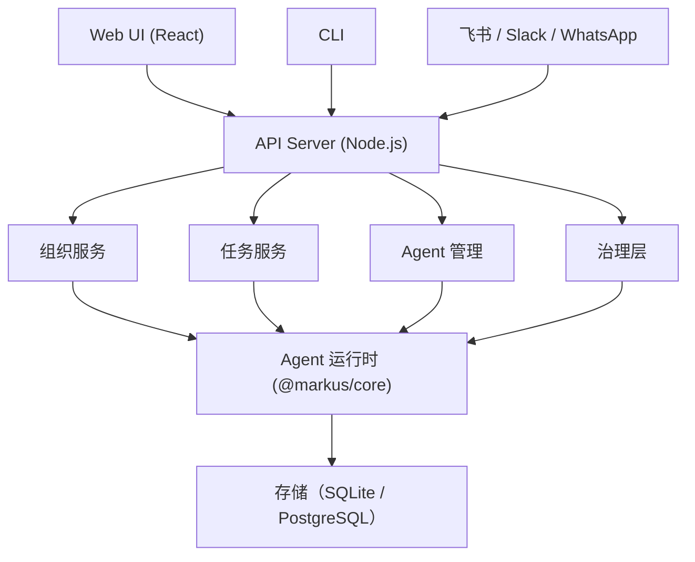

# Markus

**AI 原生数字员工平台** -- 构建和管理真正能工作的自主 AI 团队，而不仅仅是聊天。

[](LICENSE)
[](https://nodejs.org/)
[](https://www.typescriptlang.org/)

[English](README.md) | [中文](README.zh-CN.md)

---

## Markus 是什么？

现有的 AI 助手是**个人工具** -- 一个人，一个聊天机器人。Markus 是**组织级平台** -- 一个组织，N 个数字员工协同工作。

|  | 个人 AI 助手 | Markus |
|---|---|---|
| **范围** | 个人生产力 | 组织级 |
| **行为** | 被动（你问它答） | 主动（心跳驱动的自主工作） |
| **环境** | 共享主机 | 每个 Agent 独立工作区 |
| **管理** | 编辑配置文件 | 雇佣 / 入职 / 评审生命周期 |
| **任务** | 仅 CLI/API | CLI + API + Web UI + 看板 |
| **协作** | 单个 Agent | 多 Agent 团队 + 治理框架 |

## 核心特性

- **自主 AI Agent** -- 拥有角色定义、技能、记忆和主动心跳行为的数字员工
- **多 Agent 团队** -- 将 Agent 组织成团队，包含管理者、执行者和人类成员
- **任务治理** -- 审批工作流、渐进式信任等级、工作区隔离、正式交付评审
- **项目管理** -- 项目迭代、看板、自动化报告
- **知识系统** -- 三层记忆（会话 / 日志 / 长期）+ 共享知识库
- **通信中心** -- Web UI 聊天、智能路由、频道，以及飞书/Slack/WhatsApp 适配器
- **Agent 间协议** -- Agent 通过结构化 A2A 消息协作
- **工具生态** -- Shell、文件、Git、网络搜索、代码搜索、MCP 集成、GUI 自动化
- **技能市场** -- 安装和分享 Agent 技能与模板

## 快速开始

### 前置要求

- Node.js >= 20
- pnpm >= 9
- LLM API Key（OpenAI、Anthropic 或 DeepSeek）

### 安装与运行

```bash
git clone https://github.com/anthropic/markus.git
cd markus
pnpm install
pnpm build

# 配置 API Key
cp .env.example .env
# 编辑 .env，至少设置一个 LLM API Key

# 启动所有服务（API + Web UI）
pnpm dev
```

在浏览器中打开 **http://localhost:3000**。使用 `admin@markus.local` / `markus123` 登录（首次登录会要求修改密码）。

API 服务运行在 `http://localhost:3001`。

<details>
<summary>Docker Compose 部署</summary>

```bash
cd deploy
cp ../.env.example .env
# 编辑 .env 填入 API Key
docker compose up -d
```

</details>

## 架构

Markus 是一个 TypeScript monorepo，包含以下包：

```
packages/
  shared/        共享类型、常量、工具函数
  core/          Agent 运行时引擎
  storage/       数据库模式 + 仓储层（SQLite / PostgreSQL）
  org-manager/   组织管理 + REST API + 治理服务
  comms/         通信适配器（飞书、Slack、WhatsApp）
  a2a/           Agent 间协议
  gui/           GUI 自动化（VNC + OmniParser）
  web-ui/        Web 管理界面（React + Vite + Tailwind）
  cli/           CLI 入口 + 服务编排
```



完整架构文档请参考 [docs/ARCHITECTURE.zh-CN.md](docs/ARCHITECTURE.zh-CN.md)。

## 文档

| 文档 | 说明 |
|------|------|
| [架构设计](docs/ARCHITECTURE.zh-CN.md) | 系统设计、包结构、核心概念 |
| [使用指南](docs/GUIDE.zh-CN.md) | 安装配置、Web UI 使用、常见问题 |
| [API 参考](docs/API.zh-CN.md) | REST API 端点和 WebSocket 事件 |
| [贡献指南](CONTRIBUTING.zh-CN.md) | 开发环境、代码规范、PR 流程 |

所有文档均提供[英文](docs/ARCHITECTURE.md)和[中文](docs/ARCHITECTURE.zh-CN.md)版本。

## 参与贡献

欢迎贡献！请阅读[贡献指南](CONTRIBUTING.zh-CN.md)了解开发环境配置、代码规范和 PR 流程。

```bash
# 开发工作流
pnpm install
pnpm build
pnpm dev        # 启动开发服务
pnpm test       # 运行测试
pnpm typecheck  # 类型检查
pnpm lint       # 代码检查
```

## 许可证

Markus 采用双重许可：

- **开源版本**：[AGPL-3.0](LICENSE) -- 可免费自托管、个人使用和社区贡献
- **商业版本**：[可用](LICENSE-COMMERCIAL.md) -- 适用于 SaaS 部署和闭源修改

通过市场分享的 Agent 模板和技能可以使用各自的许可证（通常为 MIT）。

## 社区

- [GitHub Issues](https://github.com/anthropic/markus/issues) -- Bug 报告和功能请求
- [GitHub Discussions](https://github.com/anthropic/markus/discussions) -- 提问和讨论
