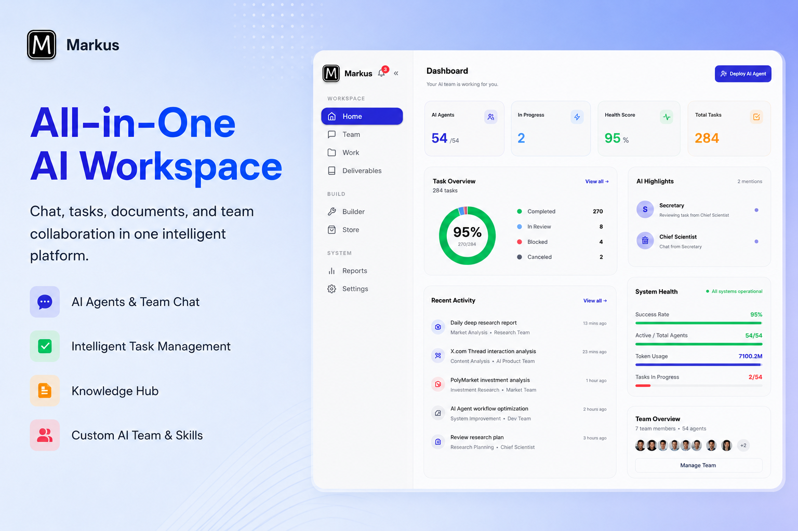

<p align="center">
  
</p>

<h1 align="center">Markus</h1>

<p align="center"><strong>真正能交付的 AI 团队。</strong></p>

<p align="center">
  开源 AI 员工平台。开发、调研、写作、分析 &mdash;<br>
  全天候运转，成本是真人团队的零头。一条命令部署，手机随时掌控。
</p>

<p align="center">
  <a href="https://github.com/markus-global/markus/actions/workflows/ci.yml">
    
  </a>
  <a href="https://github.com/markus-global/markus/releases">
    
  </a>
  <a href="https://github.com/markus-global/markus/stargazers">
    
  </a>
  <a href="https://github.com/markus-global/markus/blob/main/LICENSE">
    
  </a>
  <a href="https://github.com/markus-global/markus/issues">
    
  </a>
</p>

<p align="center">
  <a href="https://www.markus.global">官网</a> &middot;
  <a href="docs/GUIDE.md">文档</a> &middot;
  <a href="https://github.com/markus-global/markus/discussions">讨论</a> &middot;
  <a href="CONTRIBUTING.md">参与贡献</a>
</p>

<p align="center">
  <a href="README.md">English</a> | <strong>中文</strong>
</p>

<p align="center">
  
</p>

---

## Markus 是什么？

Markus 是一个**运行完整 AI 团队的开源平台** — 不是对其他智能体的封装。你定义角色（开发、审查、研究、写作、分析、运维），分配工作，Markus 负责其余一切：任务拆解、委派、并行执行、质量审查和交付。

不同于将任务分派给外部 CLI 工具的智能体编排器，**Markus 内置了完整的智能体运行时**。每个智能体直接调用 LLM API，使用内置工具（Shell、文件、Git、Web 搜索、代码分析、MCP），维护五层持久化记忆，并通过心跳机制主动运作 — 即使你不在线。

**部署在云服务器上，用手机就能管理整个 AI 公司。** 响应式 Web 界面同时适配桌面和移动端 — 随时随地查看进度、审核交付物、与智能体对话。

**零配置启动。** 无需 Docker、PostgreSQL 或 Go 编译器。一条命令，你的 AI 团队就开始运转。

---

## 快速开始

```bash
# 安装
curl -fsSL https://markus.global/install.sh | bash
# 或者: npm install -g @markus-global/cli

# 启动
markus start
```

打开 **http://localhost:8056** — 引导向导将引导你设置姓名、邮箱和密码。初始登录：`admin@markus.local` / `markus123`。

就这样。SQLite 数据库，内置 Web 界面，无需额外安装任何依赖。

> **从源码运行：** `git clone https://github.com/markus-global/markus.git && cd markus && pnpm install && pnpm build && pnpm dev`

---

## 工作原理

### 1. 描述你的需求

用自然语言告诉内置的秘书智能体你的目标。它会组建合适的团队，将需求拆解为任务，并建立项目。

> *"我需要一个研究团队，调研竞品，撰写竞争分析报告，并起草市场进入策略。"*

### 2. 智能体并行执行

智能体之间自动委派、生成子智能体、互相审查、仅在需要时才向你汇报。每个智能体在独立工作区中运作。开发者在 Git 工作树中写代码，研究员整理调研结果，写手产出文稿 — 全部同时进行。

### 3. 审查并交付

你只需审查最终交付物 — 而非过程。每项产出都经过质量门控。完整的审计日志记录了每个智能体做了什么、何时做的。

---

## 核心能力

### 自主智能体运行时
每个智能体都是完整的 LLM 驱动工作者，内置工具：Shell、文件读写、Git、Web 搜索、代码分析，以及任意 MCP 服务器。智能体直接执行任务，不依赖外部 CLI 工具。支持**任意 LLM 提供商**：Anthropic、OpenAI、Google、DeepSeek、MiniMax、Ollama 等，并具备自动故障转移。

### 五层记忆系统
会话上下文、结构化记忆、每日日志、长期知识（`MEMORY.md`）和智能体身份（`ROLE.md`）。上下文在重启后依然保持结构化和可用，而不仅仅存在于单次对话中。

### 主动心跳机制
智能体不只是等待指令。心跳调度器驱动定期巡检 — 检查待办任务、处理后台完成的操作、发现阻塞问题。你的团队在你睡觉时也在工作。

### 团队协作 & A2A
基于角色的架构，支持管理者、执行者和多个人类用户协同。智能体之间委派任务、发送结构化消息，通过内置的智能体间协议（A2A）协作。人类用户之间通过私信、群聊和 @提及进行沟通 — 消息精准推送，会话隔离。子智能体生成机制允许任何智能体将工作拆分给轻量级并行工作者。

### 治理 & 信任
渐进式信任等级（试用、标准、可信、资深）控制智能体的自主权限。正式的提交-审查-合并交付流程。紧急停止、全局暂停和公告广播。每个操作都有完整的审计日志。

### 多用户通讯
跨频道、私信、群聊和外部平台的智能路由。邀请团队成员、管理角色（所有者/管理员/成员/访客），保持对话井然有序。原生桥接 Slack、飞书、WhatsApp 和 Telegram — 让智能体在你的团队常用的地方沟通。

### 技能市场
从 Markus Hub 浏览和安装智能体模板、团队配置和可复用技能。与社区分享最佳实践。

### 随时随地管理
部署到任意云服务器，用手机即可运营你的 AI 公司。完全响应式仪表盘适配桌面和移动端 — 实时 KPI 指标、任务分布、团队状态、活动动态、流式执行日志。地铁上审核交付物，沙发上批准任务。你的团队永不停歇，你的掌控也是。

---

## 为什么不直接用单个 AI 智能体？

单个智能体 — Claude Code、Codex、ChatGPT 或任何 Copilot — 擅长一次执行一个任务。但一个员工撑不起一家公司。单个智能体做不到：

- **协调** — 无法将子任务委派给其他智能体或追踪依赖关系
- **记忆** — 会话结束后上下文就消失了
- **主动运作** — 每次都在等你的提示
- **互相审查** — 在"智能体说完成了"和"真正完成了"之间没有质量关卡
- **规模化** — 运行 10 个智能体意味着 10 个窗口，零共享可见性

Markus 是组织层。角色、团队、任务看板、审查、治理、持久化记忆，以及一个展示每个智能体工作状态的仪表盘 — 覆盖开发、研究、写作、运维以及你交给它们的任何工作。你管理的是一支团队，而不是一个个提示词。

---

## 架构

```
┌─────────────────────────────────────────────────────────┐
│                   Web UI (React)                        │
│       仪表盘 · 聊天 · 项目 · 构建器 · Hub                  │
└──────────────────────┬──────────────────────────────────┘
                       │ REST + WebSocket
┌──────────────────────┴──────────────────────────────────┐
│                组织管理器 （API 服务器）                   │
│     认证 · 任务 · 治理 · 项目 · 报告                       │
└──────────────────────┬──────────────────────────────────┘
                       │
┌──────────────────────┴──────────────────────────────────┐
│                 智能体运行时 （Core）                     │
│  Agent * LLM 路由 * 工具 * 记忆 * 心跳 * A2A              │
└──────────┬────────────────────────────┬─────────────────┘
           │                            │
┌──────────┴──────────┐    ┌────────────┴─────────────────┐
│  存储 (SQLite)       │    │  通讯 (Slack, 飞书,           │
│                     │    │   WhatsApp, Telegram)        │
└─────────────────────┘    └──────────────────────────────┘
```

TypeScript Monorepo，模块化包结构：

| 包 | 职责 |
|---------|------|
| **core** | 智能体运行时 — LLM 路由、工具、记忆、心跳、工作区隔离 |
| **org-manager** | REST API、WebSocket、治理、任务生命周期 |
| **web-ui** | React + Vite + Tailwind 仪表盘 |
| **storage** | SQLite（默认）/ PostgreSQL 持久化，基于 Drizzle |
| **cli** | `@markus-global/cli` — 一条命令安装和启动 |
| **a2a** | 智能体间通信协议 |
| **comms** | 外部平台桥接 |
| **shared** | 共享类型、常量、工具函数 |

---

## 文档

| 指南 | 说明 |
|-------|-------------|
| [用户指南](docs/GUIDE.md) | 安装、配置、Web 界面使用 |
| [架构设计](docs/ARCHITECTURE.md) | 系统设计、智能体运行时、记忆、治理 |
| [记忆系统](docs/MEMORY-SYSTEM.md) | 五层记忆系统详解 |
| [API 参考](docs/API.md) | REST API 接口 |
| [参与贡献](CONTRIBUTING.md) | 开发环境搭建、PR 流程 |

---

## 参与贡献

```bash
pnpm install && pnpm build
pnpm dev          # 开发模式启动 API + Web UI
pnpm test         # 运行测试
pnpm typecheck    # TypeScript 类型检查
pnpm lint         # ESLint 检查
```

想参与贡献？
- [Good first issues](https://github.com/markus-global/markus/labels/good%20first%20issue) — 适合新手的任务
- [Help wanted](https://github.com/markus-global/markus/labels/help%20wanted) — 社区需要的功能
- [Bug reports](https://github.com/markus-global/markus/issues) — 帮助修复问题

详见 [CONTRIBUTING.md](CONTRIBUTING.md)。

---

## 许可证

Markus 采用双重许可：

- **开源**：[AGPL-3.0](LICENSE) — 自托管和社区贡献免费使用
- **商业**：[可用](LICENSE-COMMERCIAL.md) — 适用于 SaaS 部署和专有修改

通过市场分享的智能体模板和技能可能使用各自的许可证（通常为 MIT）。

---

<p align="center">
  <a href="https://www.markus.global">官网</a> &middot;
  <a href="https://github.com/markus-global/markus/discussions">讨论</a> &middot;
  <a href="https://github.com/markus-global/markus/issues">问题反馈</a>
</p>

<p align="center">
  <sub>Markus — AI 智能体协同工作的地方</sub>
</p>
