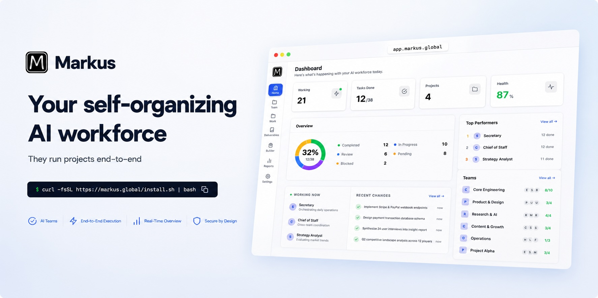

<p align="center">
  
</p>

<h1 align="center">Markus</h1>

<p align="center">
  <strong>创建真正能交付的 AI 团队。</strong>
</p>

<p align="center">
  开源 AI 员工平台 — 分角色 Agent 自主规划、执行、互相审查、交付成果。<br />
  在你的电脑或一台小云服务器上全天候运转。
</p>

<p align="center">
  <a href="https://github.com/markus-global/markus/actions/workflows/ci.yml">
    
  </a>
  <a href="https://github.com/markus-global/markus/releases">
    
  </a>
  <a href="https://github.com/markus-global/markus/stargazers">
    
  </a>
  <a href="https://github.com/markus-global/markus/blob/main/LICENSE">
    
  </a>
  <a href="https://github.com/markus-global/markus/issues">
    
  </a>
</p>

<p align="center">
  <a href="https://www.markus.global"><strong>官网</strong></a> ·
  <a href="https://markus.global/blog">博客</a> ·
  <a href="docs/GUIDE.md">文档</a> ·
  <a href="https://github.com/markus-global/markus/discussions">讨论区</a> ·
  <a href="CONTRIBUTING.md">参与贡献</a>
</p>

<p align="center">
  <a href="README.md">English</a> | <strong>中文</strong>
</p>

<p align="center">
  
</p>

---

## Markus 是什么？

**Markus 是一个运行完整 AI 团队的开源平台** — 不是对别人 Agent 的包装，也不只是一个框架。

用自然语言描述你的目标。Markus 会组建合适的角色团队（开发、审查、调研、写作、分析、运维），把工作拆解成任务、分派给专家、并行执行、经过质量评审，然后交付最终成果。

它是单 Agent 助手所缺少的**组织层**：

- **内置完整 Agent 运行时** — 每个 Agent 直接对接 LLM API，使用内置工具：shell、文件读写、git、网页搜索、代码分析、GUI 与浏览器自动化、任意 MCP 服务。不依赖外部 CLI 工具代理执行。
- **零配置即可启动** — SQLite 存储、内置 Web UI、一条命令。无需额外安装任何东西。
- **随时随地管理** — 响应式控制台支持桌面与手机，另有 macOS / Windows / Linux 桌面应用。部署到任意云服务器，用手机管理你的 AI 公司。

---

## 🚀 快速开始

选择最顺手的方式。

**桌面应用**（macOS / Windows / Linux）— 从 [Releases](https://github.com/markus-global/markus/releases/latest) 下载。

**npm**（需要 Node.js 22+）：

```bash
npm install -g @markus-global/cli
markus start
```

**Linux 一键安装**（无需 Node.js）：

```bash
curl -fsSL https://markus.global/install.sh | bash
```

**从源码运行**：

```bash
git clone https://github.com/markus-global/markus.git && cd markus
pnpm install && pnpm build && pnpm dev
```

打开 **http://localhost:8056** — 引导向导会帮你设置姓名、邮箱和密码（初始登录：`admin@markus.local` / `markus123`）。

就这样。SQLite 数据库、内置 Web UI、零外部依赖。

---

## 🎬 效果演示


实时任务看板、Agent 对话、交付物评审、团队状态 — 桌面和手机都能用。

---

## 💼 可以用 Markus 做什么

| 领域 | 示例 |
|------|---------|
| **调研与分析** | 扫描竞品、输出竞争分析报告、起草进入市场策略 |
| **软件工程** | 从需求到代码到测试完整交付一个功能，内置同行评审 |
| **内容与发布** | 起草、编辑、评审、排期发布文章、报告和社媒内容 |
| **运营** | 每日简报、问题分流、定时监控、阻塞升级 |
| **数据与报告** | 拉取数据、分析、定时交付成品报告 |
| **个人研究** | 深挖任意主题，拿回结构化、带引用的交付物 |

你合上电脑，团队仍在工作 — 心跳机制让 Agent 在你睡觉时持续推进。

---

## ✨ 核心特性

| | |
|---|---|
| **🤖 自主 Agent 运行时** &nbsp;&nbsp;&nbsp; | 每个 Agent 都是完整的 LLM 驱动员工，内置工具：shell、文件读写、git、网页搜索、代码分析、GUI 与浏览器自动化、任意 MCP 服务。支持**任意 LLM 供应商**：Anthropic、OpenAI、Google、DeepSeek、MiniMax、Ollama、OpenRouter、SiliconFlow、Moonshot — 自动故障切换。 |
| **🧠 持久记忆** | 三层记忆（程序性、语义性、情景性）跨会话积累知识并自动整理沉淀 — Agent 越用越聪明。 |
| **⏰ 主动心跳** | Agent 不会干等指令。心跳调度器自动巡检待办任务、处理异步完成、上报阻塞 — 你睡觉时团队也在干活。 |
| **🤝 团队协作与 A2A** | 基于角色的组织架构：管理者、执行者、子 Agent、结构化的 Agent 间通信。人类通过私信、群聊和 @提及 参与。 |
| **✅ 治理与信任** | 渐进式信任级别（试用 → 标准 → 信任 → 资深）、正式的提交-审查-合并交付、紧急暂停、每一步都有完整审计轨迹。 |
| **💬 多渠道消息** | 原生接入 Slack、飞书、WhatsApp、Telegram — Agent 出现在你的团队已经在用的地方。 |
| **🛠 技能市场** | 从 Markus Hub 浏览并安装 Agent 模板、团队配置和可复用技能。分享你的最佳实践。 |
| **📱 桌面 + 手机** | macOS / Windows / Linux Electron 桌面应用，加上响应式 Web 控制台。通勤路上评审交付物，沙发上审批任务。 |
| **🔒 自托管，数据自主** | 默认 SQLite，完全运行在你的基础设施上。可通过 Cloudflare Tunnel、Tailscale、FRP、ngrok 远程访问。 |

---

## 工作原理

### 1. 描述你的需求
用自然语言把目标告诉内置的 Secretary Agent。它会组建合适的团队、把需求拆解成任务、并建立项目。

> *"我需要一个调研团队，扫描竞品、写一份竞争分析、再起草一份进入市场的策略。"*

### 2. Agent 并行执行
Agent 之间互相委派、派生子 Agent、审查彼此的工作，只在必要时升级。每个 Agent 在自己的隔离工作区中运行。开发者写代码、研究员汇总发现、文案产出草稿 — 同时进行。

### 3. 审查与交付
你审查最终交付物，而不是过程。每个产出都经过质量关卡，完整审计轨迹记录了每个 Agent 在何时、做了什么、为什么。

---

## 单个 Agent vs. Markus 团队

单个 Agent — Claude Code、Codex、ChatGPT 或任意 copilot — 擅长一次执行一个任务。但一个员工撑不起一家公司。

| | 单个 AI Agent | Markus AI 团队 |
|---|---|---|
| **规模** | 一次一个任务 | 多个专家角色并行工作 |
| **记忆** | 会话结束上下文就蒸发 | 持久化、自动整理的长效记忆 |
| **主动性** | 每次都等你的指令 | 心跳驱动 24/7 工作，你睡觉也在干 |
| **质量** | “完成了”是自说自话 | 同事审查、互相纠错、把关交付 |
| **可见性** | 10 个 Agent = 10 个窗口 | 一个看板看清所有人的状态 |

你管理的是一个团队，而不是一堆零散的 Prompt。

---

## 架构

```
┌─────────────────────────────────────────────────────────┐
│              Web UI (React) · Desktop (Electron)        │
│      Dashboard · Chat · Projects · Builder · Hub        │
└──────────────────────┬──────────────────────────────────┘
                       │ REST + WebSocket
┌──────────────────────┴──────────────────────────────────┐
│                  Org Manager (API Server)               │
│     Auth · Tasks · Governance · Projects · Reports      │
└──────────────────────┬──────────────────────────────────┘
                       │
┌──────────────────────┴──────────────────────────────────┐
│                  Agent Runtime (Core)                   │
│  Agent · LLM Router · Tools · Memory · Heartbeat · A2A  │
└──────────┬────────────────────────────┬─────────────────┘
           │                            │
┌──────────┴──────────┐    ┌────────────┴─────────────────┐
│  Storage (SQLite /  │    │  Comms (Slack, Feishu,       │
│   PostgreSQL)       │    │   WhatsApp, Telegram)        │
└─────────────────────┘    └──────────────────────────────┘
```

TypeScript monorepo，模块化包结构：

| 包 | 职责 |
|---------|------|
| **core** | Agent 运行时 — LLM 路由、工具、记忆、心跳、工作区隔离 |
| **org-manager** | REST API、WebSocket、治理、任务生命周期 |
| **web-ui** | React + Vite + Tailwind 控制台 |
| **desktop** | Electron 桌面应用（macOS / Windows / Linux） |
| **cli** | `@markus-global/cli` — 一条命令安装启动 |
| **storage** | SQLite 持久化（零外部依赖） |
| **gui** | GUI 自动化 — VNC、截图、输入控制、视觉分析 |
| **comms** | Slack / 飞书 / WhatsApp / Telegram 桥接 |
| **a2a** | Agent 间通信协议 |
| **remote** | 远程访问 — 隧道与零配置组网 |
| **chrome-extension** | 通过 Markus 扩展实现浏览器自动化 |
| **shared** | 共享类型、常量、工具 |

---

## 文档

| 指南 | 说明 |
|------|------|
| [用户指南](docs/GUIDE.md) | 安装、配置、Web 控制台使用 |
| [架构设计](docs/ARCHITECTURE.md) | 系统设计、Agent 运行时、记忆、治理 |
| [Agent 运行时](docs/AGENT-RUNTIME.md) | Agent 生命周期、执行模型、工作区隔离 |
| [工具系统](docs/TOOL-SYSTEM.md) | 内置工具、MCP 集成、工具契约 |
| [记忆系统](docs/MEMORY-SYSTEM.md) | 三层记忆架构（Tulving） |
| [认知架构](docs/COGNITIVE-ARCHITECTURE.md) | 认知准备流水线（CPP）设计 |
| [邮箱系统](docs/MAILBOX-SYSTEM.md) | Agent 注意力模型、优先级队列、分诊 |
| [提示词工程](docs/PROMPT-ENGINEERING.md) | 系统提示词组装、工具循环、压缩 |
| [状态机](docs/STATE-MACHINES.md) | 任务与需求 FSM 规范 |
| [API 参考](docs/API.md) | REST API 端点与 WebSocket 事件 |
| [编码工具](docs/CODING-TOOLS.md) | Claude Code / Codex / Cursor 集成 |
| [学习循环](docs/LEARNING-LOOP.md) | Agent 自我改进与记忆沉淀 |
| [远程访问](docs/REMOTE-ACCESS.md) | Cloudflare Tunnel、Tailscale、FRP、ngrok 配置 |
| [发布与分发](docs/RELEASE-AND-DISTRIBUTION.md) | 构建、打包、发布流水线 |
| [博客](https://markus.global/blog) | 关于 Markus 与 AI Agent 的文章与教程 |

---

## 参与贡献

```bash
pnpm install && pnpm build
pnpm dev          # API + Web UI 开发模式
pnpm test         # 运行测试
pnpm typecheck    # TypeScript 检查
pnpm lint         # ESLint
```

想贡献一份力量？

- [第一个好 issue](https://github.com/markus-global/markus/labels/good%20first%20issue) — 适合新手的任务
- [Help wanted](https://github.com/markus-global/markus/labels/help%20wanted) — 社区需要的功能
- [Bug 反馈](https://github.com/markus-global/markus/issues) — 帮我们修问题

完整指南见 [CONTRIBUTING.md](CONTRIBUTING.md)。

---

## 许可协议

Markus 采用双许可证：

- **开源版**：[AGPL-3.0](LICENSE) — 自托管与社区贡献免费
- **商业版**：[另行提供](LICENSE-COMMERCIAL.md) — 适用于 SaaS 部署与私有化修改

市场上共享的 Agent 模板和技能可采用各自的许可证（通常为 MIT）。

---

<p align="center">
  <a href="https://www.markus.global">官网</a> ·
  <a href="https://markus.global/blog">博客</a> ·
  <a href="https://github.com/markus-global/markus/discussions">讨论区</a> ·
  <a href="https://github.com/markus-global/markus/issues">Issues</a>
</p>

<p align="center">
  <sub>Markus — Where AI Agents Work as a Team</sub>
</p>