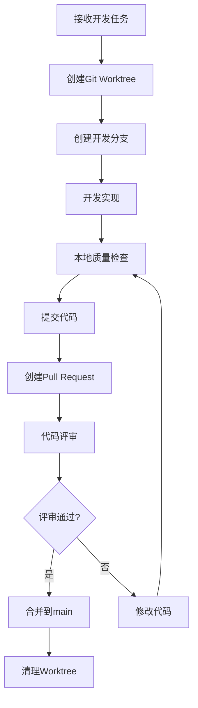

# Agent标准开发流程设计方案

## 1. 概述

### 1.1 目标
建立规范的Agent开发流程，确保代码质量和团队协作效率，支持多Agent并发开发。

### 1.2 核心原则
1. **隔离性**：每个Agent开发时互不影响
2. **标准化**：统一的开发流程和规范
3. **自动化**：质量检查和评审流程自动化
4. **协作性**：支持团队协作和知识共享

## 2. 流程设计

### 2.1 完整开发流程


### 2.2 详细阶段说明

#### 阶段1：开发前准备
1. **任务分析**：明确需求、验收标准和依赖关系
2. **环境检查**：确保开发环境正常
3. **Worktree创建**：创建隔离的开发环境

#### 阶段2：开发过程
1. **代码编写**：遵循代码规范
2. **本地测试**：编写和运行单元测试
3. **定期提交**：小步提交，有意义的提交信息

#### 阶段3：开发完成检查
1. **Git Diff检查**：检查修改是否合理
2. **代码规范检查**：TypeScript、ESLint等
3. **测试运行**：确保所有测试通过
4. **构建验证**：确保项目可以正常构建

#### 阶段4：提交流程
1. **代码提交**：git add + git commit
2. **推送分支**：git push origin <branch-name>
3. **创建PR**：在GitHub/GitLab创建Pull Request

#### 阶段5：代码评审
1. **评审分配**：自动或手动分配评审人员
2. **评审过程**：使用评审checklist
3. **评审反馈**：提供具体的修改建议
4. **评审通过**：至少1-2个评审人员批准

#### 阶段6：合并和清理
1. **代码合并**：合并到main分支
2. **Worktree清理**：删除worktree
3. **分支删除**：删除开发分支

## 3. Git Worktree方案

### 3.1 Worktree命名规范
```
格式：<agent-name>/<feature-name>-<timestamp>
示例：ai-god/standard-dev-process-20240302
```

### 3.2 Worktree目录结构
```
worktrees/
├── ai-god/
│   ├── standard-dev-process-20240302/
│   └── another-feature-20240303/
├── devbot/
│   └── git-tool-20240302/
└── README.md
```

### 3.3 Worktree生命周期管理
1. **创建**：基于最新main分支创建
2. **使用**：在worktree中开发
3. **同步**：定期同步main分支更新
4. **清理**：开发完成后删除

### 3.4 多Worktree并发支持
- 每个Agent可以同时有多个worktree
- 支持不同功能并行开发
- 自动检测worktree冲突

## 4. 代码评审机制

### 4.1 评审流程
1. **PR创建**：自动创建PR并分配评审人员
2. **评审标准**：使用统一的评审checklist
3. **评审反馈**：代码注释和讨论
4. **评审结果**：通过/拒绝/需要修改

### 4.2 评审Checklist模板

#### 代码质量
- [ ] 代码可读性良好
- [ ] 命名规范一致
- [ ] 函数长度适中
- [ ] 注释清晰必要

#### 功能实现
- [ ] 需求完全实现
- [ ] 边界条件处理
- [ ] 错误处理完善
- [ ] 性能考虑充分

#### 测试覆盖
- [ ] 单元测试覆盖
- [ ] 集成测试覆盖
- [ ] 测试代码质量
- [ ] 边界条件测试

#### 安全性和性能
- [ ] 无安全漏洞
- [ ] 内存使用合理
- [ ] 无循环引用
- [ ] 依赖版本安全

### 4.3 评审工具需求
1. **代码对比界面**：支持行级注释
2. **评审状态跟踪**：实时显示评审进度
3. **自动化检查集成**：自动运行质量检查
4. **通知系统**：评审分配和结果通知

## 5. 质量检查自动化

### 5.1 检查内容

#### Git Diff检查
- 检查意外修改的文件
- 检查代码格式一致性
- 检查关键文件保护

#### 代码规范检查
- TypeScript类型检查
- ESLint代码规范
- Prettier代码格式化
- 代码复杂度检查

#### 测试覆盖率检查
- 单元测试覆盖率要求（≥80%）
- 集成测试要求
- 测试代码质量检查

#### 安全性和性能检查
- 安全检查（敏感信息、安全漏洞）
- 性能检查（内存泄漏、循环引用）
- 依赖安全检查

### 5.2 检查工具集成
```bash
# 统一检查脚本
pnpm run check:all

# 分步检查
pnpm run check:git-diff
pnpm run check:code-style
pnpm run check:tests
pnpm run check:security
```

### 5.3 检查报告
- 详细的检查结果
- 问题分类和优先级
- 修复建议
- 检查通过/失败状态

## 6. 异常处理流程

### 6.1 冲突解决
1. **检测冲突**：自动检测代码冲突
2. **冲突解决指导**：提供解决建议
3. **手动解决**：必要时人工介入

### 6.2 回滚机制
1. **自动回滚**：检查失败时自动回滚
2. **手动回滚**：支持手动回滚到指定版本
3. **回滚验证**：验证回滚后的状态

### 6.3 故障恢复
1. **环境故障**：开发环境异常恢复
2. **构建故障**：构建失败恢复
3. **测试故障**：测试环境恢复

## 7. 文档和培训

### 7.1 文档结构
1. **流程文档**：完整的开发流程说明
2. **工具文档**：各工具的使用指南
3. **规范文档**：代码和提交规范
4. **FAQ文档**：常见问题解答

### 7.2 培训计划
1. **新Agent入职培训**：开发流程和工具使用
2. **流程变更培训**：流程更新和优化
3. **最佳实践分享**：定期分享会

### 7.3 知识传递
1. **知识库**：集中存储开发知识
2. **导师制度**：新老Agent结对
3. **代码审查**：通过代码审查传递知识

## 8. 实施计划

### 8.1 第一阶段：设计和工具开发（1-2周）
1. 完成流程设计文档
2. 开发Git Worktree管理工具
3. 开发代码质量检查工具

### 8.2 第二阶段：评审流程实现（1-2周）
1. 实现代码评审流程
2. 开发评审工具/界面
3. 集成自动化检查

### 8.3 第三阶段：文档和培训（1周）
1. 创建完整文档
2. 准备培训材料
3. 进行团队培训

### 8.4 第四阶段：试点和优化（1-2周）
1. 小范围试点运行
2. 收集反馈和优化
3. 全面推广使用

## 9. 成功指标

### 9.1 质量指标
- 代码缺陷率降低 ≥30%
- 测试覆盖率提升 ≥20%
- 代码评审通过率 ≥90%

### 9.2 效率指标
- 开发周期缩短 ≥20%
- 冲突解决时间减少 ≥50%
- 代码合并等待时间减少 ≥40%

### 9.3 协作指标
- 团队协作满意度提升
- 知识共享频率增加
- 新Agent上手时间缩短

## 10. 风险和应对

### 10.1 技术风险
- **风险**：工具集成复杂度高
- **应对**：分阶段实施，先核心后扩展

### 10.2 流程风险
- **风险**：流程过于复杂影响效率
- **应对**：保持流程简洁，持续优化

### 10.3 人员风险
- **风险**：团队接受度低
- **应对**：充分沟通，提供培训支持

---

*设计完成时间：2026-03-02*
*设计者：AI God*
*版本：v1.0*