# Markus 系统架构深度分析报告

> 版本：v0.3.0 | 分析日期：2026-03-04 | 基于源码深度调研

---

## 目录

1. [项目概述](#1-项目概述)
2. [整体架构](#2-整体架构)
3. [核心模块详解](#3-核心模块详解)
   - 3.1 [Agent 系统](#31-agent-系统)
   - 3.2 [Team 系统](#32-team-系统)
   - 3.3 [Task 系统](#33-task-系统)
   - 3.4 [Template 系统](#34-template-系统)
   - 3.5 [Chat 系统](#35-chat-系统)
   - 3.6 [Skill 系统](#36-skill-系统)
   - 3.7 [Workflow 引擎](#37-workflow-引擎)
   - 3.8 [LLM 路由层](#38-llm-路由层)
   - 3.9 [存储层](#39-存储层)
4. [模块间关系全景图](#4-模块间关系全景图)
5. [与业界框架对比分析](#5-与业界框架对比分析)
   - 5.1 [OpenClaw 架构借鉴](#51-openclaw-架构借鉴)
   - 5.2 [CrewAI / AutoGen / LangGraph / OpenAI Agents SDK](#52-crewai--autogen--langgraph--openai-agents-sdk)
6. [核心问题诊断：为何仍是"玩具"而非"工具"](#6-核心问题诊断为何仍是玩具而非工具)
7. [改进路线图](#7-改进路线图)
8. [附录：PlantUML 源码](#8-附录plantuml-源码)

---

## 1. 项目概述

Markus 定位为 **AI Native Digital Employee Platform**——一个 AI 原生的数字员工平台。其核心愿景是：用户可以创建一个虚拟组织（Organization），在其中部署多个 AI Agent 担任不同角色（开发、运维、产品、市场等），这些 Agent 组成 Team，自动执行 Task，并通过 Chat 与人类交互。

**技术栈**：TypeScript + pnpm monorepo + React + Drizzle ORM + SQLite

**包结构**：

| 包 | 职责 | 上游依赖 |
|---|---|---|
| `@markus/shared` | 共享类型、工具函数、日志、ID 生成 | 无（基础包） |
| `@markus/comms` | 通信原语（消息通道） | shared |
| `@markus/a2a` | Agent 间通信协议与消息总线 | shared |
| `@markus/gui` | GUI 自动化能力 | shared |
| `@markus/compute` | 计算资源管理（Docker 沙箱） | shared |
| `@markus/core` | Agent 运行时、LLM 路由、工具、技能、模板、工作流 | shared, comms, gui, a2a |
| `@markus/storage` | Drizzle ORM schema、Repository、迁移 | shared |
| `@markus/org-manager` | 组织/团队/任务管理、REST API、WebSocket | core, shared, storage |
| `@markus/cli` | 命令行工具 | shared, core, compute, comms, org-manager |
| `@markus/web-ui` | React + Vite 前端 | 无工作区内依赖 |

---

## 2. 整体架构

### 2.1 分层架构总览

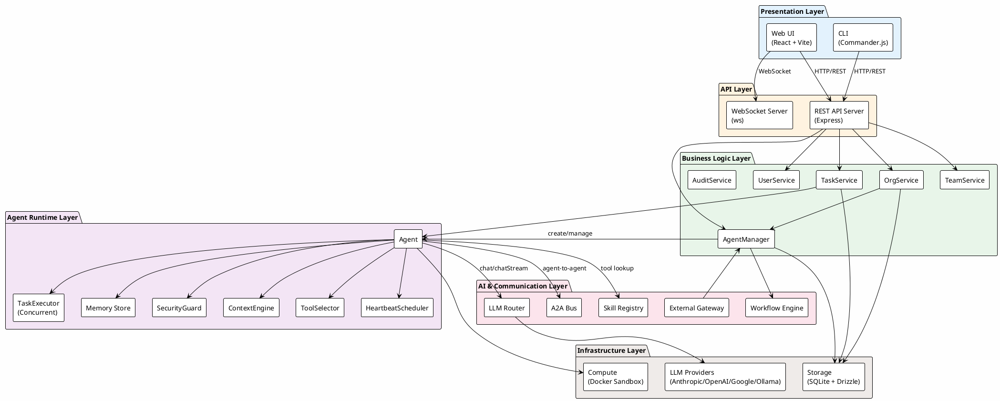

### 2.2 数据流概览

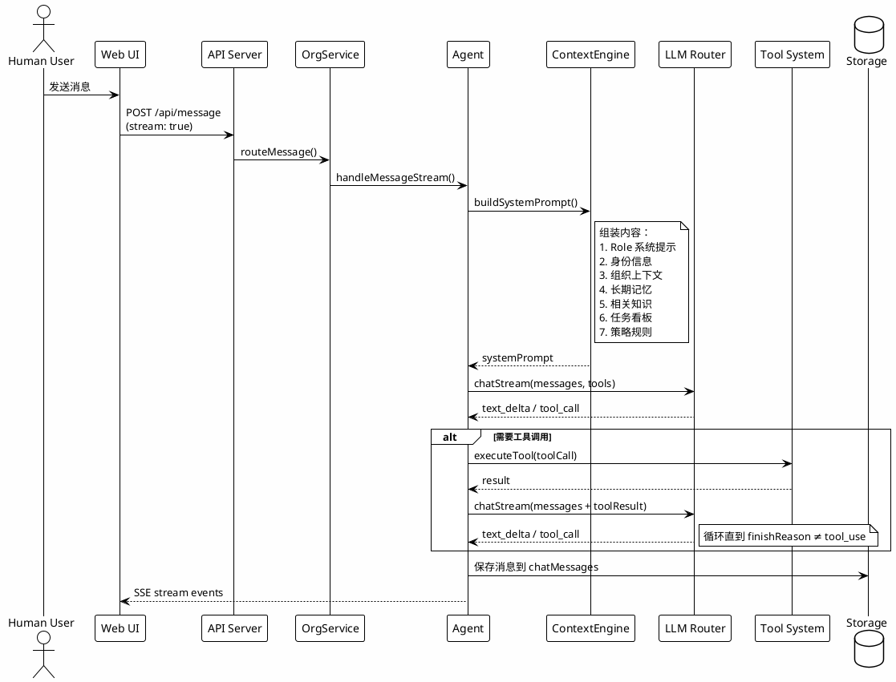

---

## 3. 核心模块详解

### 3.1 Agent 系统

Agent 是 Markus 的核心运行单元。每个 Agent 由 `AgentConfig` 配置、`RoleTemplate` 角色模板和一组运行时组件构成。

#### 3.1.1 Agent 类结构

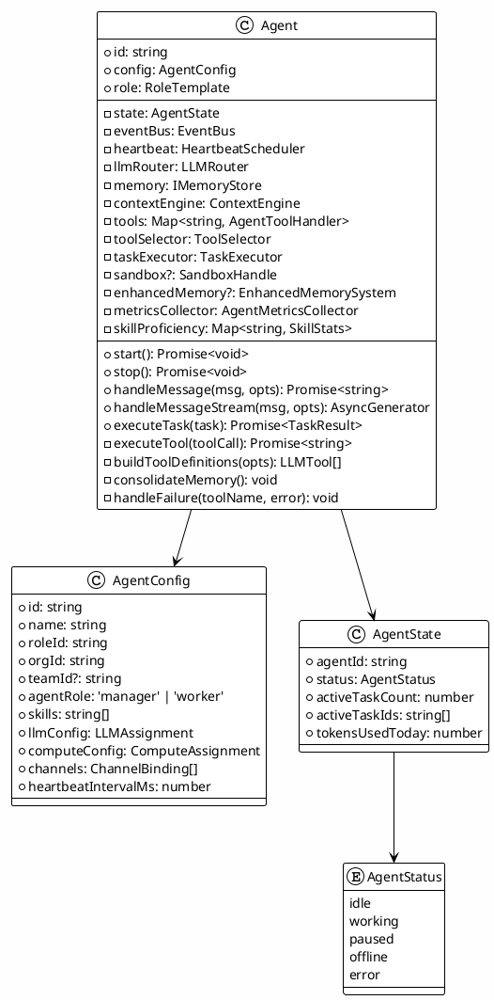

#### 3.1.2 Agent 生命周期

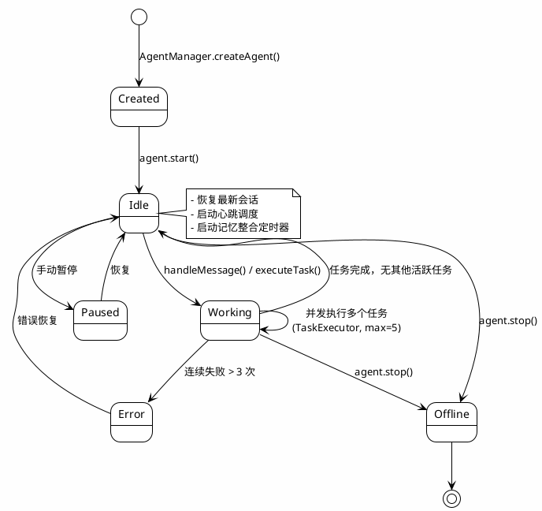

#### 3.1.3 工具系统

Agent 的工具来源丰富，通过 `AgentManager.createAgent()` 在创建时注入：

| 工具类别 | 来源 | 示例 |
|---|---|---|
| 内置工具 | `createBuiltinTools()` | shell, file_read, file_write, file_edit, web_search, web_fetch |
| A2A 工具 | `createA2ATools()` | agent_send_message, agent_list_colleagues, agent_send_group_message |
| 结构化 A2A | `createStructuredA2ATools()` | agent_delegate_task, agent_request_resource, agent_sync_progress |
| 记忆工具 | `createMemoryTools()` | memory_save, memory_search, memory_list |
| 任务工具 | `createAgentTaskTools()` | task_create, task_list, task_update, task_assign |
| 管理工具 | `createManagerTools()` | team_list, team_status, delegate_message, create_task |
| 技能工具 | `SkillRegistry` | git_*, code_analysis_*, browser_* |
| MCP 工具 | `MCPClientManager` | 外部 MCP 服务器提供的工具 |
| 沙箱工具 | Sandbox override | sandboxed_shell, sandboxed_file_* |

**工具选择机制** (`ToolSelector`)：不是一次性暴露所有工具给 LLM，而是根据上下文动态选择：

- **基础工具**总是包含（agent_send_message, task_create, memory_save 等）
- **关键词匹配**：根据用户消息中的关键词激活相关工具
- **Manager 工具**：仅 `agentRole === 'manager'` 的 Agent 可用
- **任务执行工具**：执行任务时额外包含 code/shell/git 工具
- **元工具** `discover_tools`：允许 Agent 动态请求更多工具

**工具执行重试机制**：
- 最多重试 `TOOL_RETRY_MAX = 2` 次，指数退避
- 连续失败超过 `MAX_CONSECUTIVE_FAILURES = 3` 次后触发人类升级

---

### 3.2 Team 系统

Team 是 Agent 的组织容器，代表一个协作团队。

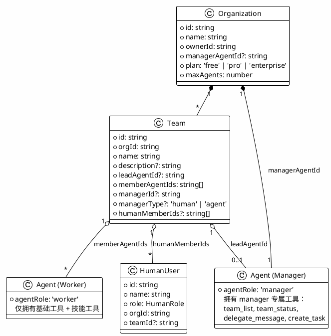

**当前实现特点**：
- Team 主要是组织分组，Agent 通过 `config.teamId` 关联
- Manager Agent 拥有额外的管理工具，可以查看团队状态、委派消息、创建任务
- Agent 间通信通过 A2A 工具（`agent_send_message`）而非直接方法调用
- 团队内的协调主要依赖 Manager Agent 的 LLM 推理能力

---

### 3.3 Task 系统

Task 是 Markus 的核心工作单元，贯穿从创建到执行的完整生命周期。

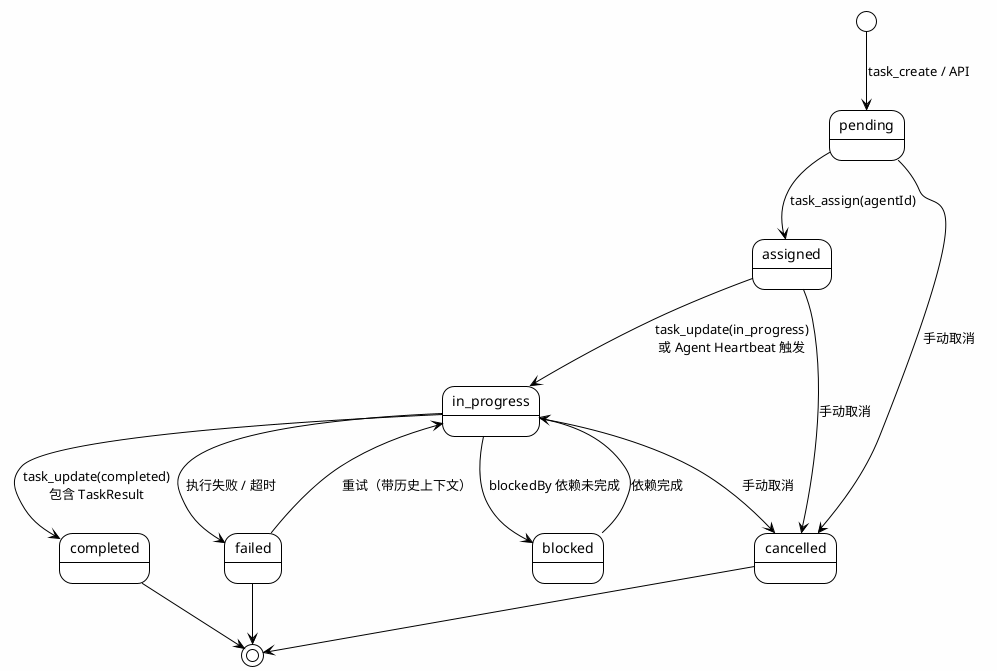

**Task 执行流程**（`TaskService.runTask()` → `Agent._executeTaskInternal()`）：

1. TaskService 检测 `status` 变为 `in_progress`，自动触发 `runTask()`
2. 加载分配的 Agent，构建任务描述（含历史执行记录，支持断点续做）
3. Agent 创建隔离 Session，构建系统提示（含任务上下文）
4. 通过 `llmRouter.chatStream()` 流式执行，支持工具调用循环
5. 执行日志（`status`, `text`, `tool_start`, `tool_end`, `error`）实时写入 `taskLogs`
6. 完成后产出 `TaskResult`（success, summary, artifacts, durationMs, tokensUsed）

**Task 层次结构**：支持 `parentTaskId` 和 `subtaskIds`，可构建任务树。支持 `blockedBy` 依赖关系。

---

### 3.4 Template 系统

Template 是 Agent 和 Team 的蓝图，分为角色模板和团队模板两个维度。

```plantuml
@startuml template-system
!theme plain
skinparam backgroundColor #FEFEFE

package "Role Templates\n(templates/roles/)" as RT {
  folder "developer/" {
    file "ROLE.md" as DevRole
    file "SKILLS.md" as DevSkills
  }
  folder "org-manager/" {
    file "ROLE.md" as MgrRole
    file "SKILLS.md" as MgrSkills
    file "HEARTBEAT.md" as MgrHB
    file "POLICIES.md" as MgrPol
  }
  folder "reviewer/" {
    file "ROLE.md" as RevRole
  }
  file "SHARED.md" as Shared
}

package "Team Templates\n(templates/teams/)" as TT {
  file "dev-team.json" as DevTeam
  file "startup-team.json" as StartupTeam
  file "marketing-team.json" as MktTeam
  file "support-team.json" as SupTeam
}

class RoleLoader {
  +loadRole(name): RoleTemplate
  -resolveRoleFiles(): Files
  -extractTitle(): string
  -parseSkillsList(): string[]
  -parseHeartbeatTasks(): HeartbeatTask[]
  -parsePolicies(): Policy[]
}

class RoleTemplate {
  +id: string
  +name: string
  +description: string
  +category: RoleCategory
  +systemPrompt: string
  +defaultSkills: string[]
  +defaultHeartbeatTasks: HeartbeatTask[]
  +defaultPolicies: Policy[]
  +builtIn: boolean
}

RoleLoader --> RT : 读取
RoleLoader --> RoleTemplate : 生成
RoleLoader --> Shared : 附加到所有角色

note bottom of RT
  当前 16 个内置角色：
  developer, qa-engineer, tech-writer,
  marketing, secretary, support, reviewer,
  project-manager, research-assistant,
  operations, hr, product-manager,
  finance, content-writer, devops,
  org-manager
end note

note bottom of TT
  团队模板定义 agents 数组：
  每个 agent 指定 name, role,
  agentRole, skills
end note

@enduml
```

**模板加载机制**：

`RoleLoader` 从 `templates/roles/<roleName>/` 目录加载：
- `ROLE.md` → 系统提示词（name, description, systemPrompt）
- `SKILLS.md` → 默认技能列表
- `HEARTBEAT.md` → 心跳任务定义
- `POLICIES.md` → 策略规则

`SHARED.md` 作为共享指令，追加到**所有**角色的系统提示词末尾。

---

### 3.5 Chat 系统

Chat 是人机交互的核心界面，支持多种交互模式。

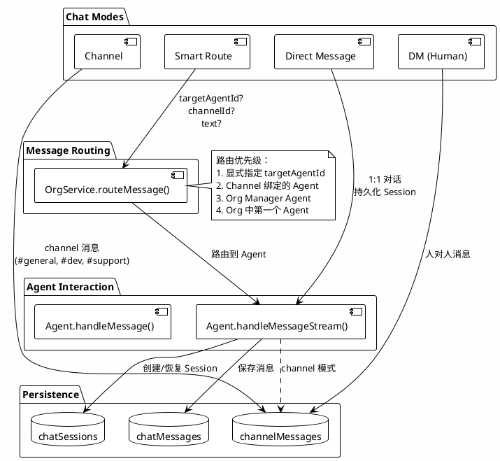

**Chat UI 特点**：
- 支持流式响应（SSE），实时显示文本和工具调用状态
- 消息分段（segments）：文本段和工具调用段交错展示
- 活动指示器（ActivityIndicator）展示工具执行过程
- 支持 Markdown 渲染

---

### 3.6 Skill 系统

Skill 是 Agent 能力的模块化封装，每个 Skill 包含一组相关工具。

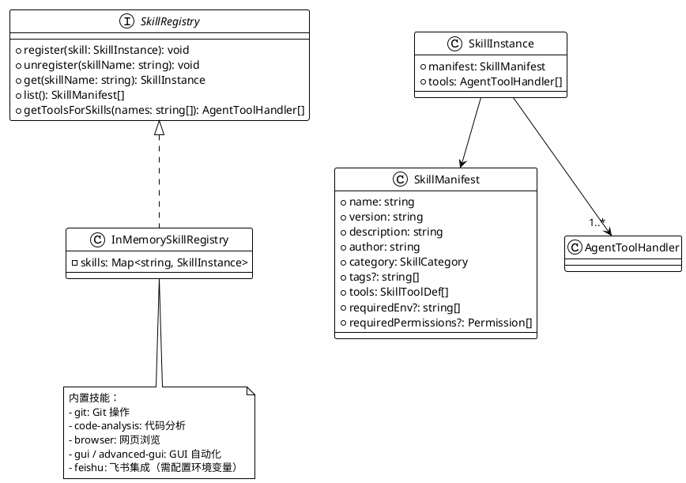

**Agent-Skill 关联**：
- `AgentConfig.skills: string[]` 声明 Agent 拥有的技能
- `AgentManager.createAgent()` 调用 `SkillRegistry.getToolsForSkills(config.skills)` 获取工具
- Agent 内部维护 `skillProficiency` Map，跟踪每个工具的使用次数、成功率

---

### 3.7 Workflow 引擎

Workflow 引擎支持 DAG 形式的多 Agent 协作编排。

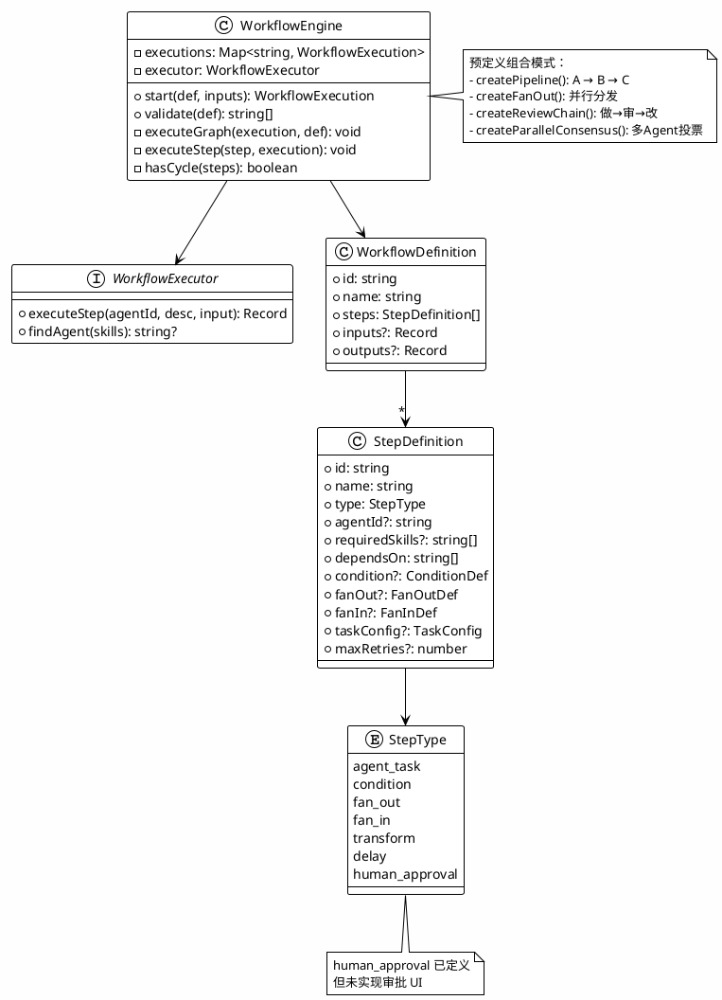

---

### 3.8 LLM 路由层

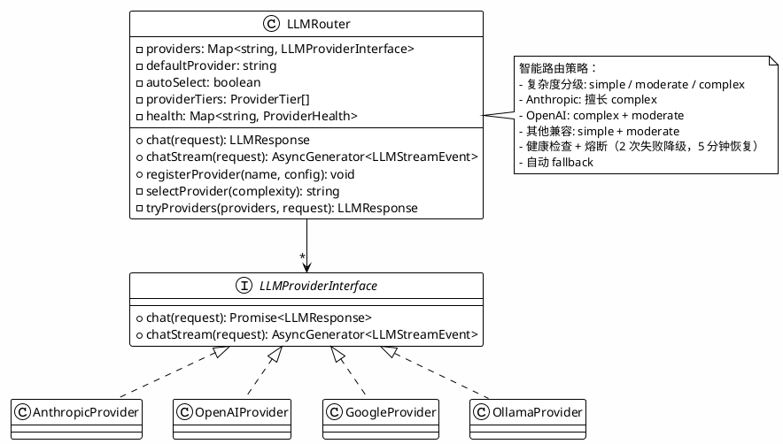

---

### 3.9 存储层

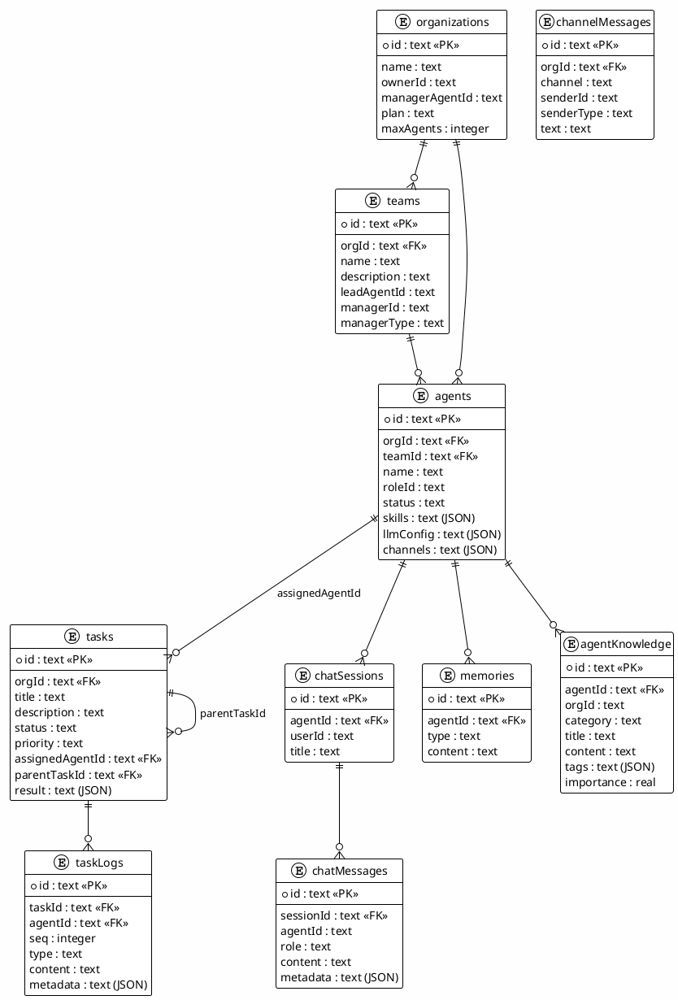

---

## 4. 模块间关系全景图

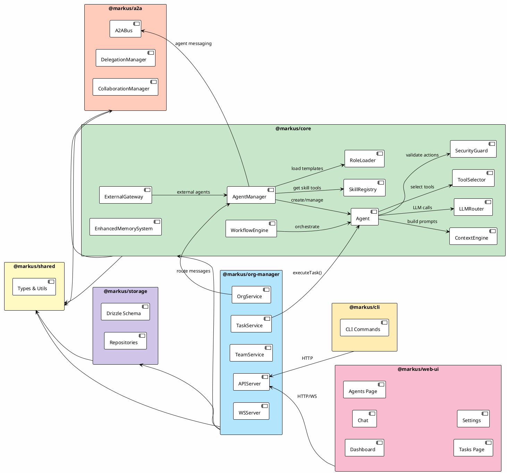

---

## 5. 与业界框架对比分析

### 5.1 OpenClaw 架构借鉴

OpenClaw 是一个自托管的 AI 网关，将 AI Agent 连接到各种消息平台（WhatsApp, Telegram, Discord, Slack 等）。其核心设计思想对 Markus 有重要参考价值。

#### OpenClaw 核心架构

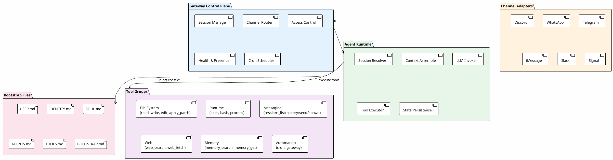

#### 关键借鉴点

| 维度 | OpenClaw 做法 | Markus 现状 | 借鉴建议 |
|---|---|---|---|
| **配置方式** | Bootstrap Files（Markdown 文件直接配置身份、规则、记忆） | ROLE.md + SKILLS.md 等，相似但更分散 | 统一为更直觉的配置方式，降低理解门槛 |
| **Session 工具** | `sessions_list`, `sessions_history`, `sessions_send`, `sessions_spawn` | A2A 工具存在但未真正连通 | 实现可靠的 session-based A2A |
| **多 Agent 路由** | 基于 channel/sender 的精确路由配置 | 简单的 routeMessage 逻辑 | 支持声明式路由规则 |
| **工具策略** | 分层策略（global → per-agent → per-provider） | 单一 SecurityGuard | 实现分层安全策略 |
| **幂等性** | 工具执行使用幂等键，安全重试 | 简单重试，无幂等保证 | 为副作用工具添加幂等键 |
| **流式中断** | 队列模式（steer, followup, collect）支持中途干预 | 无中断机制 | 实现 steering 能力 |
| **工作区模型** | 一个 Agent 一个工作区（cwd） | 无明确工作区概念 | 给每个 Agent 分配独立工作区 |

### 5.2 CrewAI / AutoGen / LangGraph / OpenAI Agents SDK

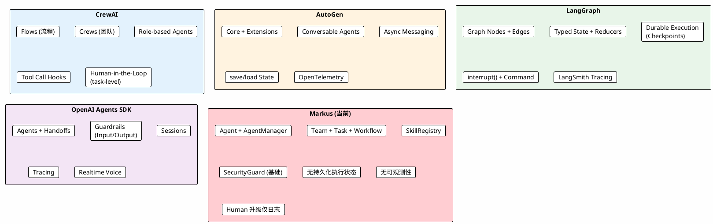

#### 对比矩阵

| 能力维度 | CrewAI | AutoGen | LangGraph | OpenAI Agents SDK | **Markus** |
|---|---|---|---|---|---|
| **工具执行可靠性** | Tool Call Hooks (before/after) | OTel spans | 包装为确定性 task | Guardrails | 简单重试 (max 2)，无钩子 |
| **状态持久化** | Pydantic state | save/load | 检查点 + 恢复 | Sessions | **无**（全内存） |
| **错误恢复** | HITL 反馈重试 | Runtime 级处理 | 检查点恢复 | 企业级错误路径 | 简单重试，人类升级仅日志 |
| **Human-in-the-Loop** | Task HITL, Flow 装饰器 | Human 作为 Agent 类型 | `interrupt()` + `Command` | 内建 HITL | **未实现**（`needsApproval` 存在但不阻塞） |
| **可观测性** | 基础日志 | OpenTelemetry | LangSmith | 内建 Tracing | **无**（仅日志） |
| **Agent 定义** | Role + 目标 + 背景 | Conversable Agents | 图节点 | Instructions + Guardrails | ROLE.md + Skills |
| **多 Agent 协作** | Crews + Flows | Multi-agent chat | 图组合 | Handoffs + agents-as-tools | A2A Bus（未真正连通） |
| **生产就绪度** | 中高 | 高 | 高 | 高 | **低** |

---

## 6. 核心问题诊断：为何仍是"玩具"而非"工具"

经过深入代码分析和框架对比，Markus 当前的核心问题**不在于缺少 Channel 集成**，而在于以下根本性的架构和工程缺陷：

### 6.1 Agent 不实用：缺乏可靠的任务执行能力

**症状**：Agent 可以对话，但无法可靠地完成实际工作任务。

**根因分析**：

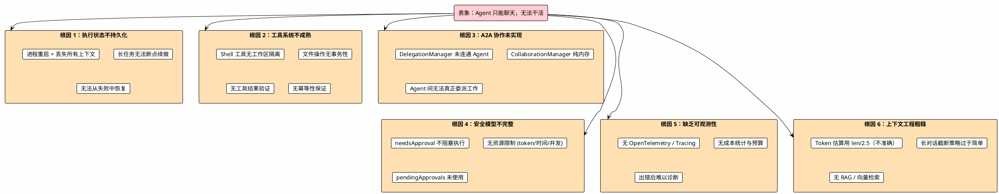

### 6.2 详细问题剖析

#### P0：执行状态完全内存化

这是最致命的问题。当前所有运行时状态（Agent 实例、工作流执行、A2A 消息、会话上下文）都保存在内存中。

- **影响**：进程重启 → 所有正在执行的任务丢失，所有 Agent 状态重置
- **对比**：LangGraph 的检查点系统、AutoGen 的 save/load state、OpenClaw 的 JSONL 会话持久化
- **量化差距**：生产系统需要保证任务不丢失；Markus 无法做到

#### P0：A2A 协作形同虚设

代码分析发现：

- `DelegationManager` 的 `task_delegate` 处理器只做日志记录，不连接实际 Agent
- `CollaborationManager` 的会话纯内存，不持久化
- `A2ABus` 每个 `AgentManager` 独立创建，Agent 间实际上不共享消息总线
- Manager Agent 的 `delegate_message` 工具只是发消息，不跟踪执行结果

**本质**：多 Agent 协作的架构已经搭建，但关键的"最后一公里"——消息真正到达 Agent 并触发工作——没有实现。

#### P1：Human-in-the-Loop 缺失

`SecurityGuard` 定义了 `needsApproval` 但返回后不阻塞执行。`pendingApprovals` Map 存在但从未使用。没有 UI 来展示审批请求。

这意味着用户无法对 Agent 的关键操作进行确认，只能事后查看日志。在实际使用中，这会导致**信任危机**——用户不敢让 Agent 执行真正重要的任务。

#### P1：工具执行不可靠

- Shell 工具直接在主机文件系统执行，无工作区隔离（Sandbox 可选但默认关闭）
- 文件操作没有事务性：写入失败可能留下半成品
- 工具结果没有结构化验证：Agent 可能基于错误的工具输出继续推理
- 无幂等性保证：重试可能导致重复副作用

#### P2：上下文工程粗糙

- Token 估算使用 `Math.ceil(text.length / 2.5)`，对英文内容偏保守，对 JSON/代码内容不准确
- 长对话管理：超过 60 条消息才触发摘要截断，此前可能已经超出上下文窗口
- 无 RAG 支持：记忆检索基于简单关键词搜索，不支持向量语义检索
- `agentKnowledge` 表已定义但知识检索能力有限

### 6.3 架构设计本身的问题

#### "组织模拟"隐喻的陷阱

Markus 试图模拟一个完整的公司组织——有 CEO（org-manager）、各部门（teams）、员工（worker agents）。这个隐喻在概念上很吸引人，但在实践中带来了过多的**组织开销**：

- 用户需要先创建组织、配置团队、部署多个 Agent，才能开始一个简单的任务
- 每个 Agent 都需要独立的 LLM 调用来理解上下文，导致 token 消耗乘以 Agent 数量
- Org Manager 作为路由中枢，每条消息都要经过它"理解和转发"，增加延迟和成本

**对比 OpenClaw**：一个 Agent，一个工作区，直接干活。需要多 Agent 时，用 `sessions_spawn` 按需创建。

**对比 CrewAI**：Crews 按任务组合，任务完成后 Crew 解散。不维持永久的组织结构。

#### 角色系统过于宽泛

16 个内置角色（developer, marketing, hr, finance...）看似功能全面，实际上：

- 角色定义只是系统提示词，缺乏**结构化的能力边界**
- 一个 "developer" Agent 和一个 "devops" Agent 在工具层面几乎相同
- 用户无法验证 Agent 是否真的具备所声称的能力
- 无 Guardrails 确保 Agent 只做角色范围内的事

---

## 7. 改进路线图

### 7.1 总体策略：从"模拟组织"到"实用工具"

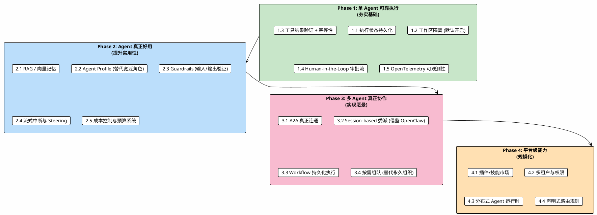

### 7.2 Phase 1 关键改进详解

#### 1.1 执行状态持久化

```
当前: Agent 状态 → 内存 → 进程重启全部丢失
目标: Agent 状态 → 数据库 → 进程重启后自动恢复

参考:
- LangGraph: Checkpoint + PostgresSaver
- AutoGen: save_state() / load_state()
- OpenClaw: JSONL transcript 持久化
```

具体措施：
- 将 `WorkflowExecution` 持久化到数据库，支持断点恢复
- 将 `Agent.state` 的关键字段（activeTasks, currentSessionId）持久化
- Task 执行的 LLM 对话历史已经通过 `chatMessages` 持久化，需要完善恢复逻辑

#### 1.2 工作区隔离

```
当前: Agent 直接操作主机文件系统
目标: 每个 Agent/Task 一个隔离工作区

参考:
- OpenClaw: 一个 Agent 一个 cwd workspace
- Markus 已有 SandboxHandle 接口，但默认关闭
```

具体措施：
- 默认启用 Docker Sandbox 或至少 chroot 级别隔离
- 每个 Agent 分配 `~/.markus/workspaces/<agentId>/` 作为工作目录
- 工具执行限制在工作区范围内

#### 1.3 工具结果验证 + 幂等性

```
当前: 工具返回字符串，Agent 自行解读
目标: 工具返回结构化结果，支持验证和重试

参考:
- CrewAI: Tool Call Hooks (before_tool_call / after_tool_call)
- OpenClaw: 幂等键
```

具体措施：
- 工具结果标准化为 `{ status: 'success' | 'error', data: any, idempotencyKey?: string }`
- 添加 before/after 钩子，支持日志、验证、审计
- 副作用工具（shell, file_write）添加幂等键机制

#### 1.4 Human-in-the-Loop 审批流

```
当前: needsApproval 返回但不阻塞
目标: 关键操作暂停等待人类审批

参考:
- LangGraph: interrupt() + Command
- CrewAI: Task-level HITL
```

具体措施：
- 实现审批等待机制：工具返回 `needsApproval` 时暂停 Agent 执行
- Web UI 添加审批请求列表和操作界面
- 支持超时自动拒绝

### 7.3 Phase 2 关键改进详解

#### 2.2 Agent Profile（替代宽泛角色）

当前的角色系统过于宽泛——一个 ROLE.md 文件无法定义 Agent 的真实能力边界。

```
当前:
  developer/ROLE.md → 大段提示词 → Agent "声称"自己能写代码
  
目标:
  Agent Profile = {
    capabilities: ['typescript', 'react', 'testing'],
    tools: ['shell', 'file_*', 'git_*'],     // 严格的工具白名单
    guardrails: [...],                         // 输入/输出验证规则
    workspace: '/path/to/workspace',           // 绑定工作区
    costBudget: { maxTokensPerTask: 50000 },   // 成本预算
    approvalRequired: ['shell:rm', 'git:push'] // 需要审批的操作
  }
```

这样 Agent 的能力是**可验证、可约束、可度量**的，而不仅仅是提示词中的"声称"。

#### 2.3 Guardrails

```
参考:
- OpenAI Agents SDK: InputGuardrail / OutputGuardrail
- 可并行或串行执行
- 支持 tripwire (触发后中止)
```

具体措施：
- 输入 Guardrail：在 Agent 处理消息前验证（如敏感信息过滤、注入检测）
- 输出 Guardrail：在 Agent 回复前验证（如合规检查、格式验证）
- 工具 Guardrail：在工具执行前验证（现有 SecurityGuard 的增强版）

### 7.4 核心设计理念转变

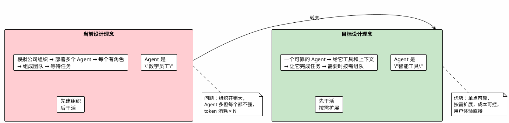

**核心转变**：

| 维度 | 当前（玩具） | 目标（工具） |
|---|---|---|
| **上手体验** | 创建组织 → 配置团队 → 部署 Agent → 开始对话 | 启动 → 直接对话 → Agent 帮你干活 |
| **Agent 数量** | 默认多个（模拟组织） | 默认一个（按需增加） |
| **能力证明** | 声称（ROLE.md 提示词） | 验证（能力测试 + Guardrails） |
| **失败处理** | 静默失败 + 日志 | 人类审批 + 断点恢复 + 清晰错误报告 |
| **成本感知** | 无（每个 Agent 独立消耗 token） | 有预算、有统计、有告警 |
| **信任建立** | 用户猜测 Agent 在做什么 | 用户看到 Agent 在做什么（可观测性） |

---

## 8. 附录：PlantUML 源码

以上所有 PlantUML 图表的源码已内嵌在对应章节中。要渲染这些图表，可以使用：

1. **VS Code 插件**：PlantUML extension（推荐）
2. **在线渲染**：https://www.plantuml.com/plantuml/uml/
3. **命令行**：`java -jar plantuml.jar docs/architecture-analysis.md`

---

## 附录 B：关键文件索引

| 文件 | 职责 |
|---|---|
| `packages/core/src/agent.ts` | Agent 核心运行时（1426 行） |
| `packages/core/src/agent-manager.ts` | Agent 生命周期管理（683 行） |
| `packages/core/src/context-engine.ts` | 上下文组装引擎（550 行） |
| `packages/core/src/tool-selector.ts` | 工具动态选择 |
| `packages/core/src/security.ts` | 安全策略执行 |
| `packages/core/src/llm/router.ts` | LLM 多 Provider 路由 |
| `packages/core/src/workflow/engine.ts` | DAG 工作流引擎 |
| `packages/core/src/workflow/types.ts` | 工作流类型定义 |
| `packages/core/src/skills/registry.ts` | 技能注册中心 |
| `packages/core/src/skills/types.ts` | 技能类型定义 |
| `packages/core/src/role-loader.ts` | 角色模板加载器 |
| `packages/core/src/external-gateway.ts` | 外部 Agent 网关 |
| `packages/a2a/src/bus.ts` | Agent 间消息总线 |
| `packages/a2a/src/delegation.ts` | 任务委派管理 |
| `packages/org-manager/src/task-service.ts` | 任务生命周期管理 |
| `packages/org-manager/src/org-service.ts` | 组织服务与消息路由 |
| `packages/org-manager/src/api-server.ts` | REST/WS API |
| `packages/storage/src/schema.ts` | 数据库 Schema |
| `packages/web-ui/src/pages/Chat.tsx` | 聊天界面 |
| `packages/web-ui/src/pages/Dashboard.tsx` | 仪表盘 |
| `templates/roles/*/ROLE.md` | 16 个内置角色模板 |
| `templates/teams/*.json` | 4 个团队模板 |

---

> **总结**：Markus 的架构设计展现了对 AI Agent 平台的深入思考——类型系统完善、模块边界清晰、概念模型丰富。但当前的核心矛盾是**架构完整性与实现可靠性之间的断裂**：定义了组织、团队、工作流、A2A 等丰富概念，但在关键的"最后一公里"——状态持久化、工具可靠性、A2A 真正连通、Human-in-the-Loop——都存在明显缺口。要从"玩具"变成"工具"，首要任务不是增加更多功能，而是让现有的单 Agent 执行流程**端到端可靠**。
