# Markus 系统架构深度分析报告

> 版本：v0.7.0 | 分析日期：2026-03-04 | 基于源码深度调研

---

## 目录

1. [项目概述](#1-项目概述)
2. [整体架构](#2-整体架构)
3. [核心模块详解](#3-核心模块详解)
   - 3.1 [Agent 系统](#31-agent-系统)
   - 3.2 [Team 系统](#32-team-系统)
   - 3.3 [Task 系统](#33-task-系统)
   - 3.4 [Template 系统](#34-template-系统)
   - 3.5 [Chat 系统](#35-chat-系统)
   - 3.6 [Skill 系统](#36-skill-系统)
   - 3.7 [Workflow 引擎](#37-workflow-引擎)
   - 3.8 [LLM 路由层](#38-llm-路由层)
   - 3.9 [存储层](#39-存储层)
4. [模块间关系全景图](#4-模块间关系全景图)
5. [与业界框架对比分析](#5-与业界框架对比分析)
   - 5.1 [OpenClaw 架构借鉴](#51-openclaw-架构借鉴)
   - 5.2 [CrewAI / AutoGen / LangGraph / OpenAI Agents SDK](#52-crewai--autogen--langgraph--openai-agents-sdk)
6. [问题诊断与解决进展](#6-问题诊断与解决进展)
   - 6.1 [已解决的核心问题](#61-已解决的核心问题)
   - 6.2 [仍待解决的问题](#62-仍待解决的问题)
   - 6.3 [架构设计反思](#63-架构设计反思)
7. [实施进展总览](#7-实施进展总览)
8. [后续路线图](#8-后续路线图)
9. [附录](#9-附录)

---

## 1. 项目概述

Markus 定位为 **AI Native Digital Employee Platform**——一个 AI 原生的数字员工平台。其核心愿景是：用户可以创建一个虚拟组织（Organization），在其中部署多个 AI Agent 担任不同角色（开发、运维、产品、市场等），这些 Agent 组成 Team，自动执行 Task，并通过 Chat 与人类交互。

**技术栈**：TypeScript + pnpm monorepo + React + Drizzle ORM + SQLite

**包结构**：

| 包 | 职责 | 上游依赖 |
|---|---|---|
| `@markus/shared` | 共享类型、工具函数、日志、ID 生成 | 无（基础包） |
| `@markus/comms` | 通信原语（消息通道） | shared |
| `@markus/a2a` | Agent 间通信协议与消息总线 | shared |
| `@markus/gui` | GUI 自动化能力 | shared |
| `@markus/compute` | 计算资源管理（Docker 沙箱） | shared |
| `@markus/core` | Agent 运行时、LLM 路由、工具、技能、模板、工作流 | shared, comms, gui, a2a |
| `@markus/storage` | Drizzle ORM schema、Repository、迁移 | shared |
| `@markus/org-manager` | 组织/团队/任务管理、REST API、WebSocket | core, shared, storage |
| `@markus/cli` | 命令行工具 | shared, core, compute, comms, org-manager |
| `@markus/web-ui` | React + Vite 前端 | 无工作区内依赖 |

---

## 2. 整体架构

### 2.1 分层架构总览

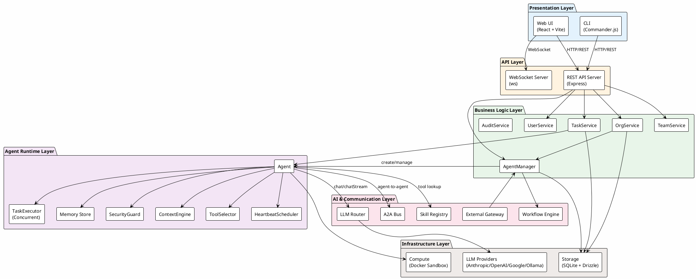

### 2.2 数据流概览

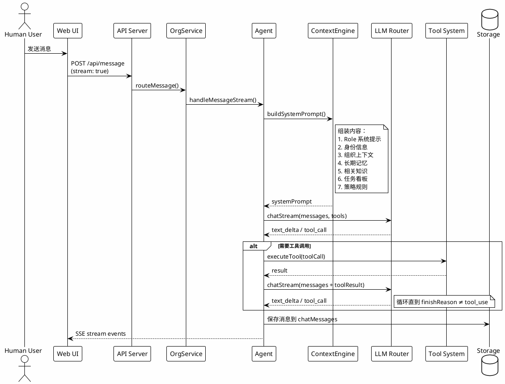

---

## 3. 核心模块详解

### 3.1 Agent 系统

Agent 是 Markus 的核心运行单元。每个 Agent 由 `AgentConfig` 配置、`RoleTemplate` 角色模板和一组运行时组件构成。

#### 3.1.1 Agent 类结构

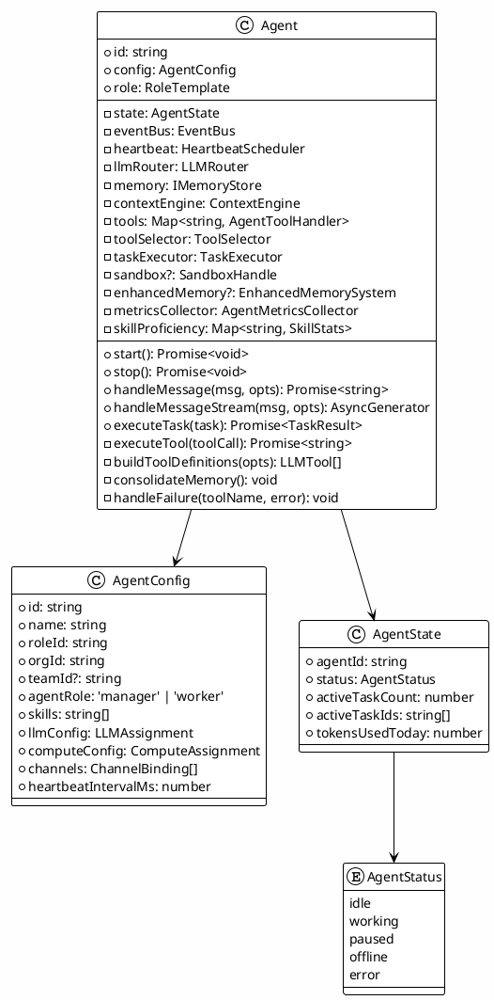

#### 3.1.2 Agent 生命周期

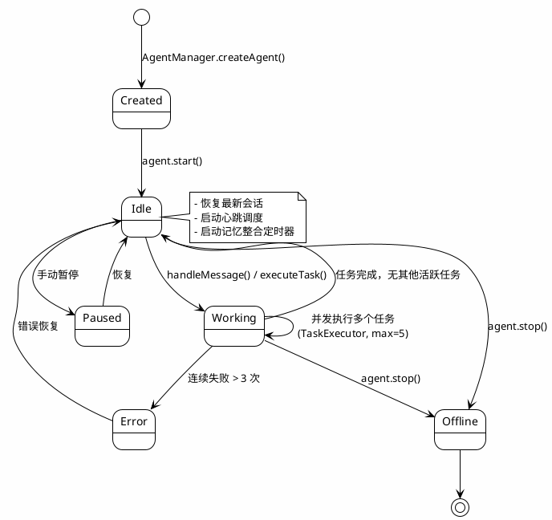

#### 3.1.3 工具系统

Agent 的工具来源丰富，通过 `AgentManager.createAgent()` 在创建时注入：

| 工具类别 | 来源 | 示例 |
|---|---|---|
| 内置工具 | `createBuiltinTools()` | shell, file_read, file_write, file_edit, web_search, web_fetch |
| A2A 工具 | `createA2ATools()` | agent_send_message, agent_list_colleagues, agent_send_group_message |
| 结构化 A2A | `createStructuredA2ATools()` | agent_delegate_task, agent_request_resource, agent_sync_progress |
| 记忆工具 | `createMemoryTools()` | memory_save, memory_search, memory_list |
| 任务工具 | `createAgentTaskTools()` | task_create, task_list, task_update, task_assign |
| 管理工具 | `createManagerTools()` | team_list, team_status, delegate_message, create_task |
| 技能工具 | `SkillRegistry` | git_*, code_analysis_*, browser_* |
| MCP 工具 | `MCPClientManager` | 外部 MCP 服务器提供的工具 |
| 沙箱工具 | Sandbox override | sandboxed_shell, sandboxed_file_* |

**工具选择机制** (`ToolSelector`)：不是一次性暴露所有工具给 LLM，而是根据上下文动态选择：

- **基础工具**总是包含（agent_send_message, task_create, memory_save 等）
- **关键词匹配**：根据用户消息中的关键词激活相关工具
- **Manager 工具**：仅 `agentRole === 'manager'` 的 Agent 可用
- **任务执行工具**：执行任务时额外包含 code/shell/git 工具
- **元工具** `discover_tools`：允许 Agent 动态请求更多工具

**工具执行重试机制**：
- 最多重试 `TOOL_RETRY_MAX = 2` 次，指数退避
- 连续失败超过 `MAX_CONSECUTIVE_FAILURES = 3` 次后触发人类升级

---

### 3.2 Team 系统

Team 是 Agent 的组织容器，代表一个协作团队。

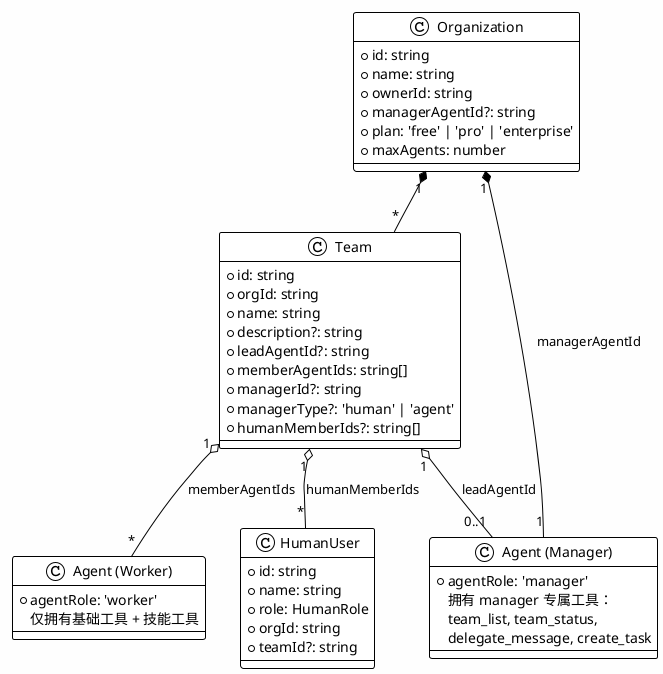

**当前实现特点**：
- Team 主要是组织分组，Agent 通过 `config.teamId` 关联
- Manager Agent 拥有额外的管理工具，可以查看团队状态、委派消息、创建任务
- Agent 间通信通过 A2A 工具（`agent_send_message`）而非直接方法调用
- 团队内的协调主要依赖 Manager Agent 的 LLM 推理能力

---

### 3.3 Task 系统

Task 是 Markus 的核心工作单元，贯穿从创建到执行的完整生命周期。

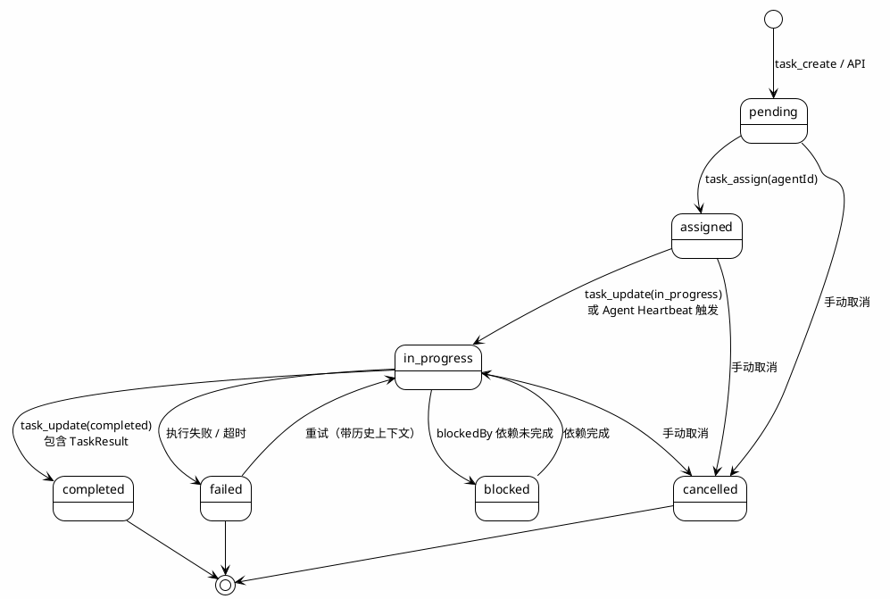

**Task 执行流程**（`TaskService.runTask()` → `Agent._executeTaskInternal()`）：

1. TaskService 检测 `status` 变为 `in_progress`，自动触发 `runTask()`
2. 加载分配的 Agent，构建任务描述（含历史执行记录，支持断点续做）
3. Agent 创建隔离 Session，构建系统提示（含任务上下文）
4. 通过 `llmRouter.chatStream()` 流式执行，支持工具调用循环
5. 执行日志（`status`, `text`, `tool_start`, `tool_end`, `error`）实时写入 `taskLogs`
6. 完成后产出 `TaskResult`（success, summary, artifacts, durationMs, tokensUsed）

**Task 层次结构**：支持 `parentTaskId` 和 `subtaskIds`，可构建任务树。支持 `blockedBy` 依赖关系。

---

### 3.4 Template 系统

Template 是 Agent 和 Team 的蓝图，分为角色模板和团队模板两个维度。

```plantuml
@startuml template-system
!theme plain
skinparam backgroundColor #FEFEFE

package "Role Templates\n(templates/roles/)" as RT {
  folder "developer/" {
    file "ROLE.md" as DevRole
    file "SKILLS.md" as DevSkills
  }
  folder "org-manager/" {
    file "ROLE.md" as MgrRole
    file "SKILLS.md" as MgrSkills
    file "HEARTBEAT.md" as MgrHB
    file "POLICIES.md" as MgrPol
  }
  folder "reviewer/" {
    file "ROLE.md" as RevRole
  }
  file "SHARED.md" as Shared
}

package "Team Templates\n(templates/teams/)" as TT {
  file "dev-team.json" as DevTeam
  file "startup-team.json" as StartupTeam
  file "marketing-team.json" as MktTeam
  file "support-team.json" as SupTeam
}

class RoleLoader {
  +loadRole(name): RoleTemplate
  -resolveRoleFiles(): Files
  -extractTitle(): string
  -parseSkillsList(): string[]
  -parseHeartbeatTasks(): HeartbeatTask[]
  -parsePolicies(): Policy[]
}

class RoleTemplate {
  +id: string
  +name: string
  +description: string
  +category: RoleCategory
  +systemPrompt: string
  +defaultSkills: string[]
  +defaultHeartbeatTasks: HeartbeatTask[]
  +defaultPolicies: Policy[]
  +builtIn: boolean
}

RoleLoader --> RT : 读取
RoleLoader --> RoleTemplate : 生成
RoleLoader --> Shared : 附加到所有角色

note bottom of RT
  当前 16 个内置角色：
  developer, qa-engineer, tech-writer,
  marketing, secretary, support, reviewer,
  project-manager, research-assistant,
  operations, hr, product-manager,
  finance, content-writer, devops,
  org-manager
end note

note bottom of TT
  团队模板定义 agents 数组：
  每个 agent 指定 name, role,
  agentRole, skills
end note

@enduml
```

**模板加载机制**：

`RoleLoader` 从 `templates/roles/<roleName>/` 目录加载：
- `ROLE.md` → 系统提示词（name, description, systemPrompt）
- `SKILLS.md` → 默认技能列表
- `HEARTBEAT.md` → 心跳任务定义
- `POLICIES.md` → 策略规则

`SHARED.md` 作为共享指令，追加到**所有**角色的系统提示词末尾。

---

### 3.5 Chat 系统

Chat 是人机交互的核心界面，支持多种交互模式。

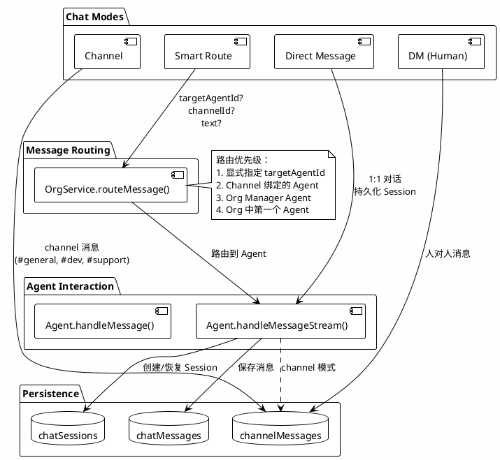

**Chat UI 特点**：
- 支持流式响应（SSE），实时显示文本和工具调用状态
- 消息分段（segments）：文本段和工具调用段交错展示
- 活动指示器（ActivityIndicator）展示工具执行过程
- 支持 Markdown 渲染

---

### 3.6 Skill 系统

Skill 是 Agent 能力的模块化封装，每个 Skill 包含一组相关工具。

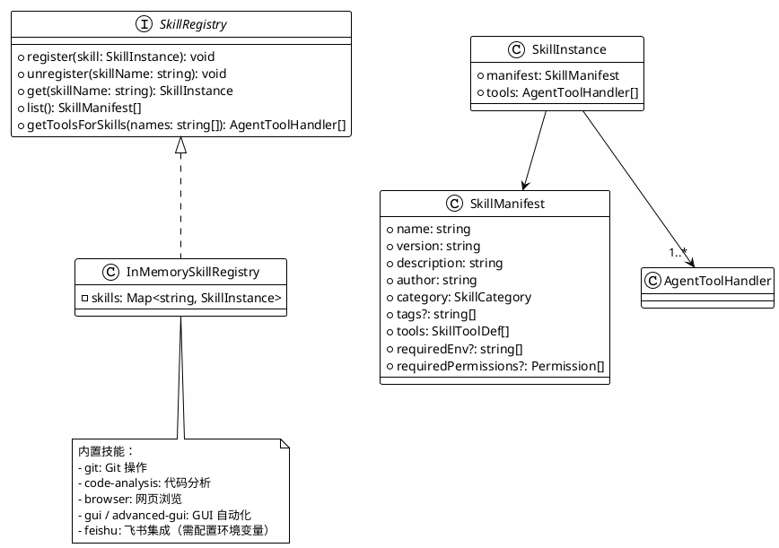

**Agent-Skill 关联**：
- `AgentConfig.skills: string[]` 声明 Agent 拥有的技能
- `AgentManager.createAgent()` 调用 `SkillRegistry.getToolsForSkills(config.skills)` 获取工具
- Agent 内部维护 `skillProficiency` Map，跟踪每个工具的使用次数、成功率

---

### 3.7 Workflow 引擎

Workflow 引擎支持 DAG 形式的多 Agent 协作编排。

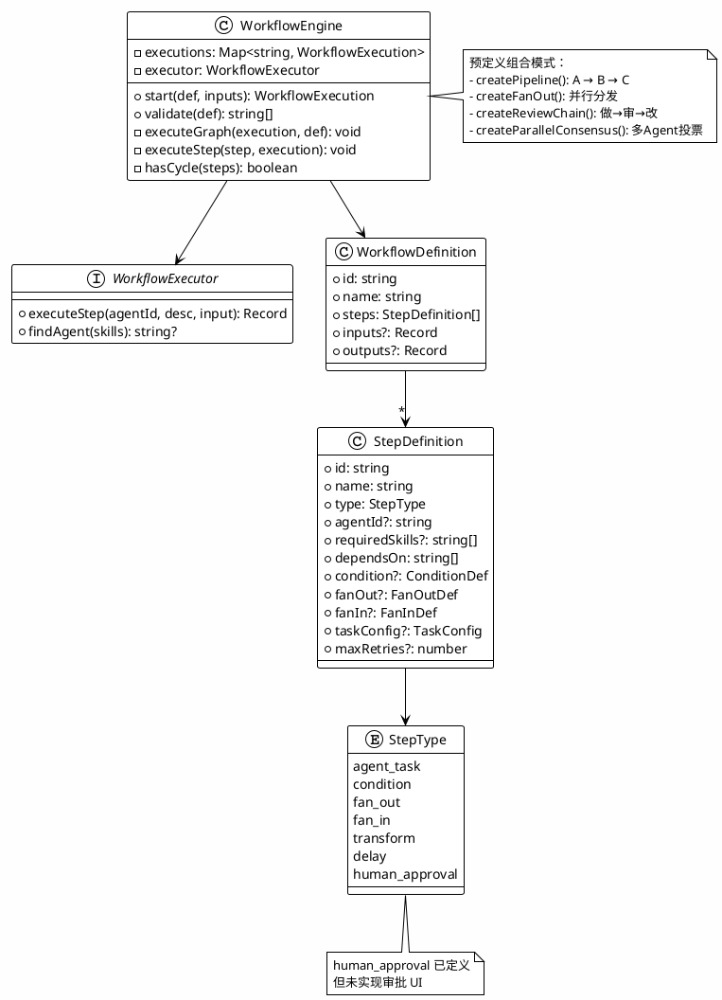

---

### 3.8 LLM 路由层

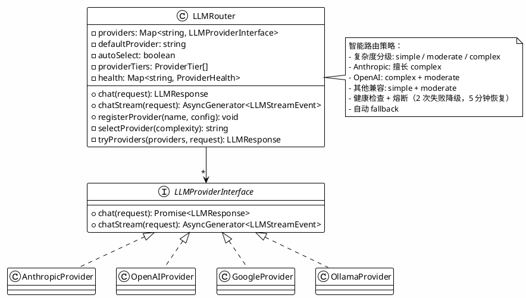

---

### 3.9 存储层

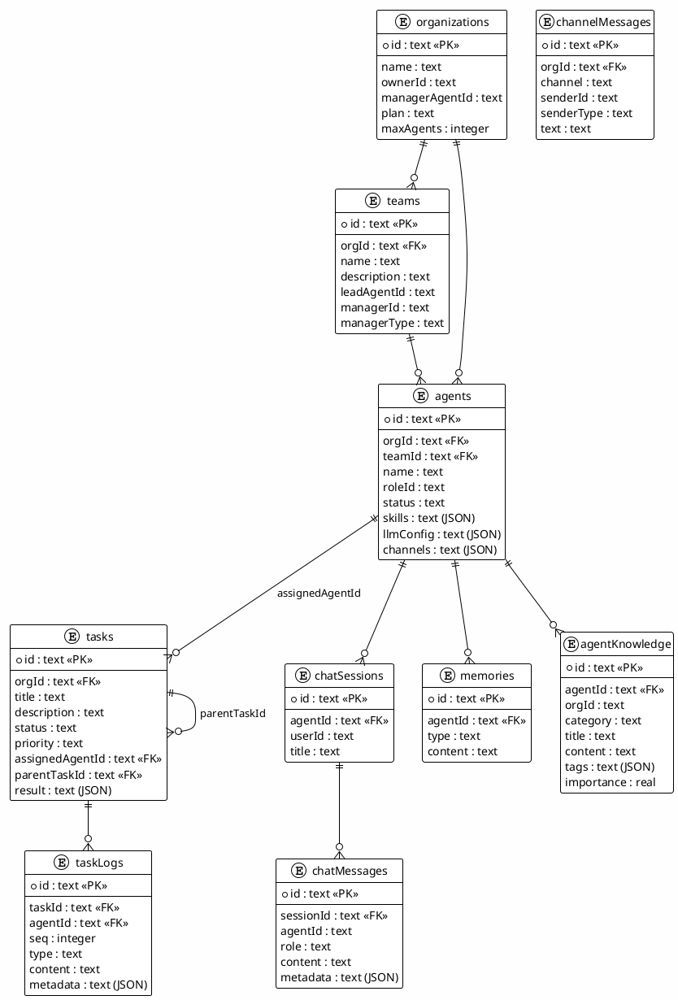

---

## 4. 模块间关系全景图

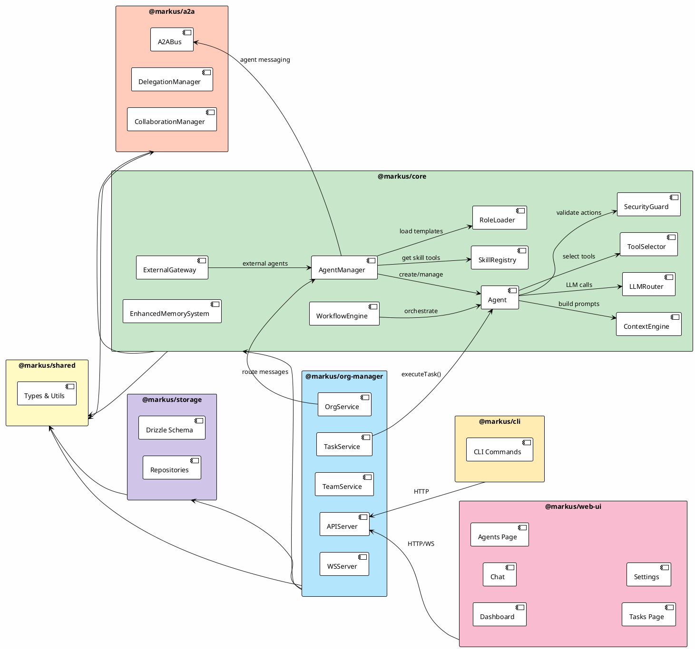

---

## 5. 与业界框架对比分析

### 5.1 OpenClaw 架构借鉴

OpenClaw 是一个自托管的 AI 网关，将 AI Agent 连接到各种消息平台（WhatsApp, Telegram, Discord, Slack 等）。其核心设计思想对 Markus 有重要参考价值。

#### OpenClaw 核心架构

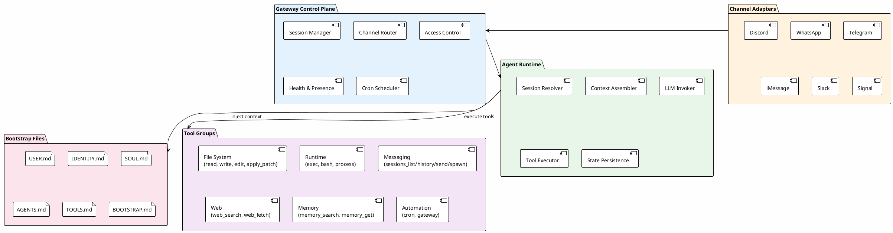

#### 关键借鉴点

| 维度 | OpenClaw 做法 | Markus 现状 | 借鉴建议 |
|---|---|---|---|
| **配置方式** | Bootstrap Files（Markdown 文件直接配置身份、规则、记忆） | ROLE.md + SKILLS.md 等，相似但更分散 | 统一为更直觉的配置方式，降低理解门槛 |
| **Session 工具** | `sessions_list`, `sessions_history`, `sessions_send`, `sessions_spawn` | A2A 工具存在但未真正连通 | 实现可靠的 session-based A2A |
| **多 Agent 路由** | 基于 channel/sender 的精确路由配置 | 简单的 routeMessage 逻辑 | 支持声明式路由规则 |
| **工具策略** | 分层策略（global → per-agent → per-provider） | 单一 SecurityGuard | 实现分层安全策略 |
| **幂等性** | 工具执行使用幂等键，安全重试 | 简单重试，无幂等保证 | 为副作用工具添加幂等键 |
| **流式中断** | 队列模式（steer, followup, collect）支持中途干预 | 无中断机制 | 实现 steering 能力 |
| **工作区模型** | 一个 Agent 一个工作区（cwd） | 无明确工作区概念 | 给每个 Agent 分配独立工作区 |

### 5.2 CrewAI / AutoGen / LangGraph / OpenAI Agents SDK

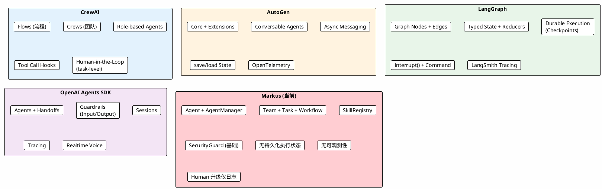

#### 对比矩阵

| 能力维度 | CrewAI | AutoGen | LangGraph | OpenAI Agents SDK | **Markus (v0.7)** |
|---|---|---|---|---|---|
| **工具执行可靠性** | Tool Call Hooks (before/after) | OTel spans | 包装为确定性 task | Guardrails | ✅ ToolHookRegistry (before/after) + 幂等缓存 + 重试 |
| **状态持久化** | Pydantic state | save/load | 检查点 + 恢复 | Sessions | ✅ DB 持久化 (status, tokens, tasks, profile) |
| **错误恢复** | HITL 反馈重试 | Runtime 级处理 | 检查点恢复 | 企业级错误路径 | ✅ 重试 + HITL 审批 + 日 token 重置恢复 |
| **Human-in-the-Loop** | Task HITL, Flow 装饰器 | Human 作为 Agent 类型 | `interrupt()` + `Command` | 内建 HITL | ✅ 审批阻塞 + REST API + 超时自动拒绝 |
| **可观测性** | 基础日志 | OpenTelemetry | LangSmith | 内建 Tracing | ✅ Tracing (OTel 兼容) + Usage Dashboard |
| **Agent 定义** | Role + 目标 + 背景 | Conversable Agents | 图节点 | Instructions + Guardrails | ✅ ROLE.md + AgentProfile (工具白名单/预算) + Guardrails |
| **多 Agent 协作** | Crews + Flows | Multi-agent chat | 图组合 | Handoffs + agents-as-tools | ✅ A2A Bus + DelegationManager (真实任务委派) |
| **成本控制** | 基础 | 无内建 | 无内建 | 企业级 | ✅ 日 token 预算 + BillingService + Usage Dashboard |
| **生产就绪度** | 中高 | 高 | 高 | 高 | **中**（核心流程可靠，缺 RAG 和分布式） |

---

## 6. 问题诊断与解决进展

初始代码分析（v0.3.0）诊断出 6 个根因阻碍 Markus 从"玩具"变为"工具"。经过 4 轮迭代，绝大多数已解决。

### 6.1 已解决的核心问题

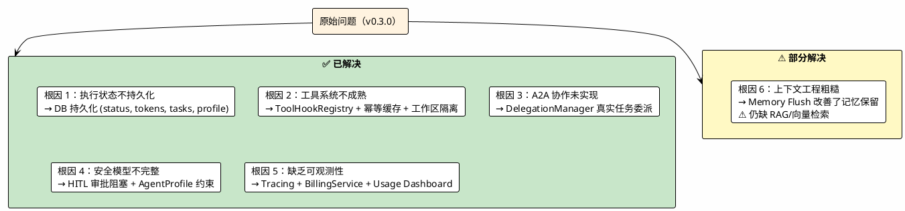

| 根因 | 原始问题 | 当前状态 | 解决方案 |
|---|---|---|---|
| **1. 状态不持久化** | 进程重启丢失所有上下文 | ✅ 已解决 | Agent status/tokens/tasks/profile 持久化到 DB；启动时自动恢复 |
| **2. 工具系统不成熟** | 无隔离、无验证、无幂等 | ✅ 已解决 | 工作区路径隔离；ToolHookRegistry (before/after)；幂等缓存 (5min TTL) |
| **3. A2A 协作形同虚设** | DelegationManager 仅记日志 | ✅ 已解决 | 委派 → 自动创建 Task 并分配给目标 Agent；AgentCard 自动注册 |
| **4. 安全模型不完整** | needsApproval 不阻塞 | ✅ 已解决 | 审批阻塞 + Promise 等待 + REST API approve/reject + 超时自动拒绝 |
| **5. 缺乏可观测性** | 无 tracing、无成本统计 | ✅ 已解决 | OTel 兼容 Tracing；BillingService 接入执行流；Usage & Costs Dashboard |
| **6. 上下文工程粗糙** | Token 估算不准、无 RAG | ⚠ 部分 | Memory Flush 改善记忆保留；`agentKnowledge` 表存在但无向量检索 |

### 6.2 仍待解决的问题

#### P1：RAG / 向量语义检索

- `agentKnowledge` 表已定义但检索基于简单关键词匹配
- 长期记忆（`memory_search`）无法按语义相关性召回
- Token 估算仍使用 `Math.ceil(text.length / 2.5)`，对非英文内容不够准确
- **建议**：集成 pgvector 或外部向量 DB，为 `agentKnowledge` 和 `memories` 添加 embedding 列

#### P1：Workflow 持久化执行

- `WorkflowExecution` 完全内存化，进程重启后丢失
- 已定义 `human_approval` 步骤类型但无审批 UI
- **建议**：将 execution state 写入 DB，支持跨重启恢复

#### P2：文件操作事务性

- 文件写入失败可能留下半成品
- 无 rollback 机制
- **建议**：写入临时文件后原子 rename；或对关键操作添加 undo 日志

#### P2：分布式 Agent 运行时

- 所有 Agent 运行在单进程中，无法水平扩展
- **建议**：远期考虑基于消息队列的分布式执行

### 6.3 架构设计反思

#### "组织模拟"隐喻的演进

Markus 的"数字员工平台"隐喻在概念上吸引人，但实践中需要平衡**组织开销**与**使用便捷性**。当前采取的策略是保留组织模型但降低使用门槛：

- 启动即创建默认组织和 Agent，用户无需手动配置即可开始对话
- AgentProfile 约束了能力边界，避免角色仅停留在"提示词声称"层面
- 按需创建 Agent，而非要求预先规划完整组织结构

**对比参考**：
- OpenClaw：一个 Agent + 一个工作区，极简模式
- CrewAI：按任务组队，临时组合
- Markus：保留组织结构，但支持单 Agent 直接对话的"捷径"模式

---

## 7. 实施进展总览

### 7.1 迭代路线与完成状态

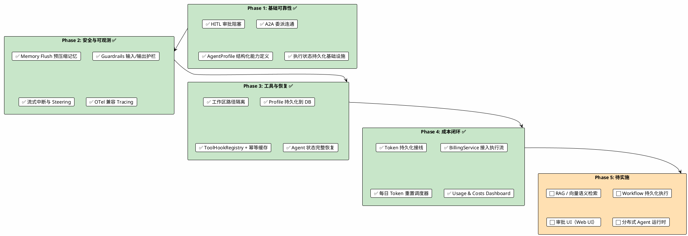

### 7.2 各 Phase 实施摘要

#### Phase 1 — 基础可靠性

| 改进项 | 解决的根因 | 关键实现 |
|---|---|---|
| A2A 委派连通 | 根因 3 (A2A 形同虚设) | `DelegationManager.onDelegationReceived()` → 自动创建 Task 并分配 |
| HITL 审批阻塞 | 根因 4 (安全模型不完整) | `ApprovalCallback` + `HITLService.requestApprovalAndWait()` + 超时拒绝 |
| AgentProfile | 根因 4 (无资源限制) | 工具白/黑名单、日 token 预算、并发限制、审批配置 |
| 状态持久化基础设施 | 根因 1 (状态内存化) | `stateChangeCallback` + DB 列 (active_task_ids, profile) |

**涉及文件**：`a2a/delegation.ts`, `core/agent.ts`, `core/agent-manager.ts`, `org-manager/hitl-service.ts`, `shared/types/agent.ts`, `storage/schema.ts`

#### Phase 2 — 安全与可观测

| 改进项 | 解决的根因 | 关键实现 |
|---|---|---|
| Memory Flush | 根因 6 (上下文粗糙) | 压缩前 ephemeral LLM 调用，持久化关键记忆 |
| Guardrails | 根因 4 (安全模型) | `GuardrailPipeline` 链式管线；内置 prompt injection/sensitive data 检测 |
| 流式中断 | 新需求 | `cancelToken` 三处检查点；`cancelActiveStream()` API |
| Tracing | 根因 5 (无可观测性) | `DefaultSpan` + `setTracingProvider()` 可替换为 OTel SDK |

**涉及文件**：`core/agent.ts`, `core/guardrails.ts` (新), `core/tracing.ts` (新), `core/llm/router.ts`

#### Phase 3 — 工具与恢复

| 改进项 | 解决的根因 | 关键实现 |
|---|---|---|
| 工作区隔离 | 根因 2 (工具不成熟) | Shell/File 工具 `workspacePath` 参数；路径越界检查 |
| Profile 持久化 | 根因 1 (状态不持久化) | DB `agents.profile` jsonb 列；`restoreAgent` 恢复 profile |
| ToolHookRegistry | 根因 2 (工具不成熟) | before/after 钩子；幂等缓存 (5min TTL)；审计日志钩子 |
| 状态恢复完善 | 根因 1 (状态不持久化) | `tokensUsedToday` + `activeTaskIds` 重启后恢复 |

**涉及文件**：`core/tools/shell.ts`, `core/tools/file.ts`, `core/tool-hooks.ts` (新), `core/agent-manager.ts`, `storage/schema.ts`

#### Phase 4 — 成本闭环

| 改进项 | 解决的根因 | 关键实现 |
|---|---|---|
| Token 持久化接线 | 根因 1 最后一公里 | `startServer()` 中 `setStateChangeHandler()` → DB 更新 |
| BillingService 接入 | 根因 5 (成本不可见) | 审计回调中 `billingService.recordUsage()`；`getAgentBreakdown()` |
| 每日 Token 重置 | 预算恢复 | `scheduleDailyReset()` 午夜触发；超限暂停后自动恢复 |
| Usage Dashboard | 根因 5 (无可视化) | `/api/usage/agents` 端点 + `Usage.tsx` 页面 + Sidebar 入口 |

**涉及文件**：`cli/index.ts`, `org-manager/api-server.ts`, `org-manager/billing-service.ts`, `web-ui/pages/Usage.tsx` (新)

---

## 8. 后续路线图

### Phase 5：待实施项目

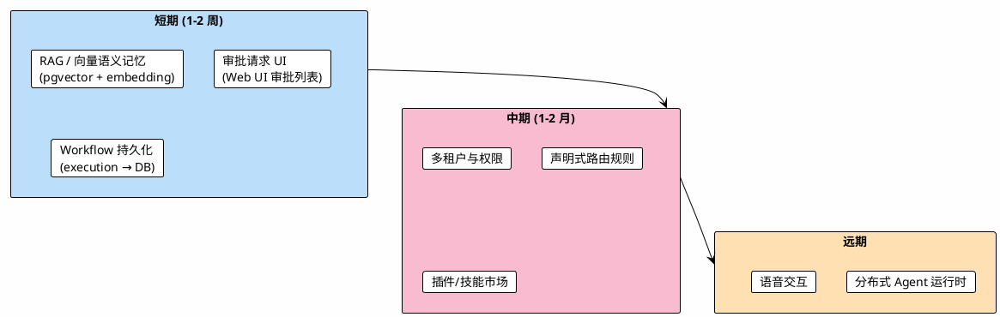

| 优先级 | 项目 | 预期价值 |
|---|---|---|
| P1 | RAG / 向量语义记忆 | Agent 能基于语义检索相关知识和历史，大幅提升长期工作能力 |
| P1 | 审批 UI | 用户可在 Web UI 中查看、批准、拒绝 Agent 的敏感操作请求 |
| P1 | Workflow 持久化 | DAG 工作流跨重启恢复，支持长周期多 Agent 编排 |
| P2 | 多租户与权限 | 支持多组织隔离，RBAC 权限模型 |
| P2 | 声明式路由规则 | 基于 channel/sender/keyword 的精确消息路由配置 |
| P3 | 插件/技能市场 | 社区贡献的工具和角色模板共享 |
| P3 | 分布式运行时 | 基于消息队列的 Agent 水平扩展 |

---

## 9. 附录

### 9.1 PlantUML 渲染

以上所有 PlantUML 图表的源码已内嵌在对应章节中。渲染方式：

1. **VS Code 插件**：PlantUML extension（推荐）
2. **在线渲染**：https://www.plantuml.com/plantuml/uml/
3. **命令行**：`java -jar plantuml.jar docs/architecture-analysis.md`

### 9.2 关键文件索引

| 文件 | 职责 |
|---|---|
| `packages/core/src/agent.ts` | Agent 核心运行时（~1700 行） |
| `packages/core/src/agent-manager.ts` | Agent 生命周期管理 |
| `packages/core/src/context-engine.ts` | 上下文组装引擎 |
| `packages/core/src/tool-selector.ts` | 工具动态选择 |
| `packages/core/src/security.ts` | 安全策略执行 |
| `packages/core/src/guardrails.ts` | 输入/输出 Guardrail 管线 |
| `packages/core/src/tracing.ts` | OTel 兼容 Tracing |
| `packages/core/src/tool-hooks.ts` | 工具执行钩子 + 幂等缓存 |
| `packages/core/src/llm/router.ts` | LLM 多 Provider 路由 |
| `packages/core/src/workflow/engine.ts` | DAG 工作流引擎 |
| `packages/core/src/skills/registry.ts` | 技能注册中心 |
| `packages/core/src/role-loader.ts` | 角色模板加载器 |
| `packages/core/src/external-gateway.ts` | 外部 Agent 网关 |
| `packages/a2a/src/bus.ts` | Agent 间消息总线 |
| `packages/a2a/src/delegation.ts` | 任务委派管理 |
| `packages/org-manager/src/task-service.ts` | 任务生命周期管理 |
| `packages/org-manager/src/org-service.ts` | 组织服务与消息路由 |
| `packages/org-manager/src/api-server.ts` | REST/WS API |
| `packages/org-manager/src/hitl-service.ts` | 人类审批服务 |
| `packages/org-manager/src/billing-service.ts` | 计费与用量统计 |
| `packages/storage/src/schema.ts` | 数据库 Schema |
| `packages/storage/src/migrate.ts` | 迁移与启动安全网 |
| `packages/web-ui/src/pages/Chat.tsx` | 聊天界面 |
| `packages/web-ui/src/pages/Dashboard.tsx` | 运营仪表盘 |
| `packages/web-ui/src/pages/Usage.tsx` | Usage & Costs 仪表盘 |
| `packages/cli/src/index.ts` | 服务启动入口与接线 |
| `templates/roles/*/ROLE.md` | 16 个内置角色模板 |
| `templates/teams/*.json` | 4 个团队模板 |

---

> **总结**：Markus v0.7.0 已完成从"玩具"到"工具"的关键转变。经过 4 轮迭代，原始诊断的 6 个根因中 5 个已完全解决（状态持久化、工具可靠性、A2A 连通、HITL 审批、可观测性），1 个部分解决（上下文工程）。系统现在支持：Agent 状态跨重启恢复、工具执行隔离与幂等、真实任务委派、敏感操作审批阻塞、OTel 兼容 Tracing、端到端成本控制与 Dashboard 可视化。下一阶段的重点是 RAG 向量检索、Workflow 持久化和审批 UI，以进一步提升 Agent 的长期工作能力和用户信任。
