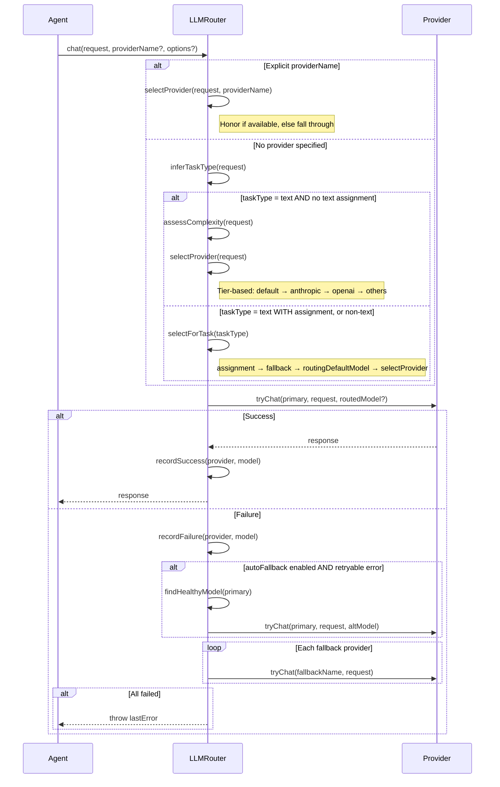
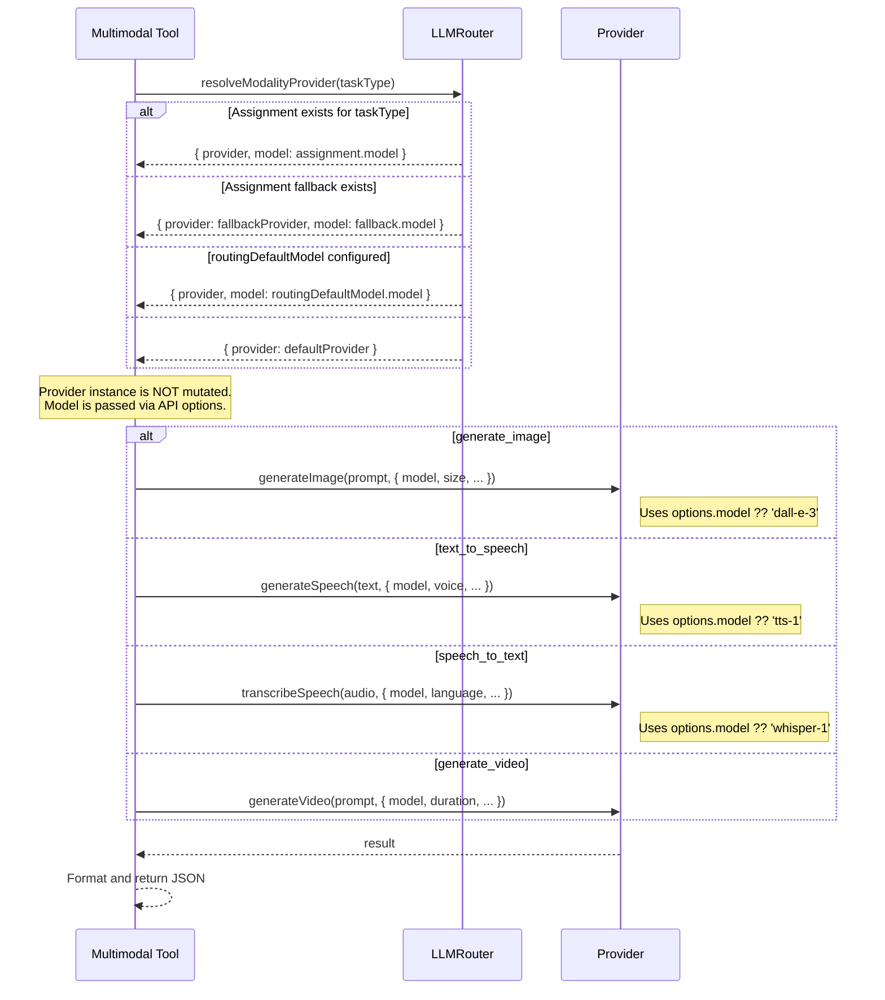
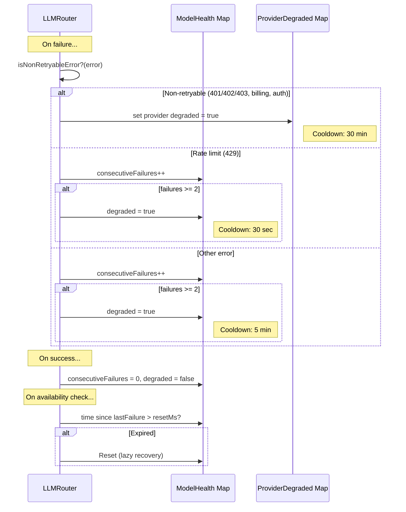

# Model Routing Architecture

## Overview

Markus uses a multi-layer model routing system built into `LLMRouter` to solve four problems:

1. **Cost optimization** — complexity-based tier selection routes simple requests to cheaper providers
2. **Multi-modal support** — unified task routing covers text, vision, image generation, TTS, STT, and video
3. **Resilience** — circuit breaker health tracking with automatic cross-provider fallback
4. **Manual control** — users can assign specific provider/model pairs to each task type

---

## Architecture

```
User Request
  │
  ▼
┌──────────────────────────────────────────────────────────┐
│                       LLMRouter                          │
│                                                          │
│  Text path (no assignment)  Text/Non-text with assignment│
│  ─────────────────────────  ────────────────────────────-│
│  assessComplexity()         selectForTask()               │
│       │                     (taskRouting.assignments      │
│       ▼                      → routingDefaultModel        │
│  selectProvider()            → selectProvider fallback)   │
│  (tier-based)                     │                      │
│       │                           │                      │
│       ▼                           ▼                      │
│  tryChat / tryStream ◄────────────┘                      │
│  (circuit breaker, health tracking, fallback chain)      │
│                                                          │
│  Multimodal tools path                                   │
│  ─────────────────────                                   │
│  resolveModalityProvider()                                │
│  → returns { provider, model }                           │
│  → caller passes model to API (no shared state mutation) │
└──────────────────────────────────────────────────────────┘
         │
         ▼
┌──────────────────────────────────────────────────────────┐
│              Provider Implementations                     │
│                                                          │
│  OpenAIProvider (implements MultiModalProviderInterface)  │
│    - chat, chatStream                                    │
│    - generateImage (options.model ?? 'dall-e-3')         │
│    - generateSpeech (options.model ?? 'tts-1')           │
│    - transcribeSpeech (options.model ?? 'whisper-1')     │
│                                                          │
│  GoogleProvider (implements MultiModalProviderInterface)  │
│    - chat, chatStream                                    │
│    - generateImage (options.model ?? gemini-image-gen)   │
│                                                          │
│  AnthropicProvider, OllamaProvider, etc.                 │
│    - chat only                                           │
└──────────────────────────────────────────────────────────┘
```

---

## Text Chat Routing (chat / chatStream)



### Complexity Assessment

| Level | Condition (any triggers) |
|-------|--------------------------|
| **complex** | `toolCount > 5` OR `totalChars > 8000` OR `msgCount > 15` |
| **moderate** | `toolCount > 0` OR `totalChars > 2000` OR `msgCount > 5` |
| **simple** | everything else |

### Provider Tier Mapping

| Provider kind | Complexity levels | Precedence |
|---------------|-------------------|------------|
| **Default provider** | simple, moderate, complex | Always first |
| **anthropic** (non-default) | complex only | |
| **openai** (non-default) | complex, moderate | |
| **Everything else** | simple, moderate | |

### Text Task Assignment

When `taskRouting.assignments.text` is configured, text chat requests use `selectForTask()` instead of complexity-based `selectProvider()`. This lets users pin a specific provider/model for all text chat.

When no text assignment exists, the classic complexity-based tier routing applies.

---

## Multi-Modal Routing (Tools)



### Key Design: No Shared State Mutation

`resolveModalityProvider()` returns a `{ provider, model }` tuple. The caller passes `model` into the provider method's `options` parameter. This prevents a critical bug where mutating `provider.model` (via `configure()`) for a modality call would corrupt subsequent chat requests on the same provider instance.

### Multi-Modal Tools

Registered via `createMultiModalTools()` in `AgentManager`:

| Tool | TaskType | Provider Method | Default Model |
|------|----------|-----------------|---------------|
| `generate_image` | `image_generation` | `generateImage()` | `dall-e-3` |
| `text_to_speech` | `audio_tts` | `generateSpeech()` | `tts-1` |
| `speech_to_text` | `audio_stt` | `transcribeSpeech()` | `whisper-1` |
| `generate_video` | `video_generation` | `generateVideo()` | (none yet) |

The assigned model from `taskRouting.assignments[taskType].model` is passed as `options.model` to each provider method. Provider methods use the assigned model if provided, otherwise fall back to their hardcoded defaults.

**Output behavior:**
- `generate_image` → returns `{ url, revisedPrompt }` or `{ base64 }`
- `text_to_speech` → saves audio to temp file, returns `{ filePath, format, sizeBytes }`
- `speech_to_text` → accepts URL or local file path, returns `{ text }`
- `generate_video` → returns `{ taskId, status, url }` (async polling)

---

## Fallback & Health Tracking



### Circuit Breaker Thresholds

| Scope | Trigger | Cooldown | Effect |
|-------|---------|----------|--------|
| **Provider** | Any non-retryable error (401/402/403, billing, invalid key) | **30 min** | Entire provider skipped |
| **Model** | 2 consecutive retryable failures | **5 min** | That `provider:model` pair skipped |
| **Model (rate limit)** | 2 consecutive 429 errors | **30 sec** | That `provider:model` pair skipped |

Recovery is lazy: checked on next `isAvailable()` / `isModelAvailable()` call after the cooldown period.

---

## Model Catalog

### Sources (merge order)

1. **Remote catalog** — fetched from LiteLLM's public model list, refreshed every 24h, cached in `~/.markus/model-catalog-cache.json`
2. **Baseline catalog** — bundled in `packages/core/data/model-catalog-baseline.json`
3. **Supplements** — additional/override entries in `model-catalog-supplements.json` (always merged last)
4. **BUILTIN_MODEL_CATALOG** — curated entries in `router.ts` with explicit tiers and costs

### Regional Provider Aliases

Regional variants share the parent provider's model catalog:

```typescript
REGIONAL_PROVIDER_ALIASES = {
  'minimax-cn': 'minimax',
  'siliconflow-intl': 'siliconflow',
};
```

`getProviderModels()` synthesizes entries for aliased providers at runtime.

---

## Tier Classification

Models are classified into three tiers: `base`, `pro`, `max`.

**Classification sources (in priority order):**
1. Explicit `tier` field on `ModelDefinition` (BUILTIN_MODEL_CATALOG entries)
2. `estimateQualityScore()` using input cost per 1M tokens:
   - `>= $3` → `max` (score >= 75)
   - `>= $0.50` → `pro` (score >= 50)
   - `< $0.50` → `base`
3. Parameter count from model name (`\d+B`) as secondary signal

---

## Configuration

All routing configuration lives in `MarkusConfig.llm`:

```typescript
interface MarkusConfig {
  llm: {
    taskRouting?: TaskRoutingConfig;        // per-task model assignments
    routingDefaultModel?: { provider: string; model: string };
    catalogMirrorUrl?: string;              // optional mirror for catalog fetch
    // ... existing fields
  };
}
```

### Task Routing Config

```typescript
interface TaskRoutingConfig {
  assignments: Partial<Record<ModelTaskType, TaskModelAssignment>>;
}

interface TaskModelAssignment {
  provider: string;
  model: string;
  fallback?: { provider: string; model: string };
}

type ModelTaskType = 'text' | 'image_recognition' | 'image_generation' | 'audio_tts' | 'audio_stt' | 'video_generation';
```

---

## API Endpoints

| Endpoint | Method | Description | Caching |
|----------|--------|-------------|---------|
| `/api/settings/llm/routing` | GET | Current routing config | None |
| `/api/settings/llm` | POST | Update routing config (taskRouting, routingDefaultModel, etc.) | None |
| `/api/models/routing-candidates` | GET | All available models per provider | 5-min server-side TTL |
| `/api/models/suggested-assignments` | GET | Auto-suggested best model per task | None |

---

## UI Components

- **`ModelRoutingSection`** — task assignment table with per-task model selection
- **`ModelSelect`** — searchable model dropdown grouped by provider
- **`ModelPicker`** — model selection with tier/cost badges for the main settings panel

### Stale Assignment Handling

When a provider is removed from configuration, its task assignments become stale. The UI shows a yellow warning badge on stale assignments instead of auto-cleaning them, letting users decide whether to clear or reconfigure.
