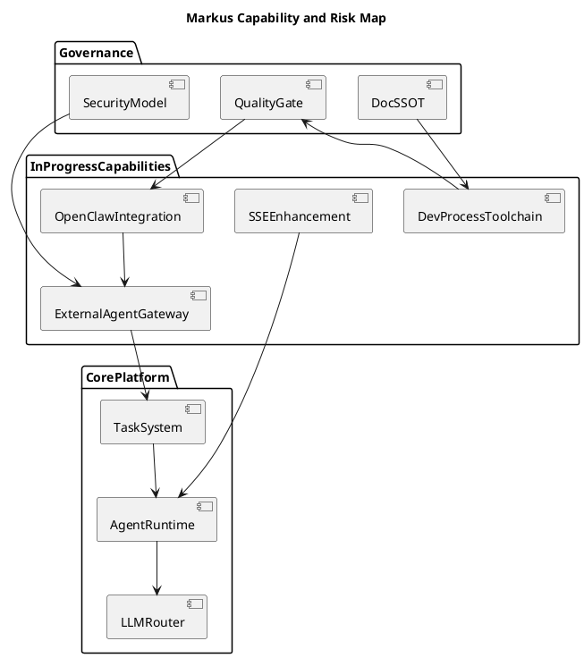
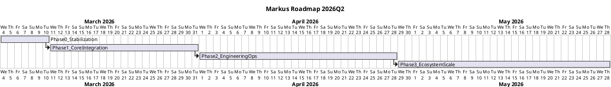
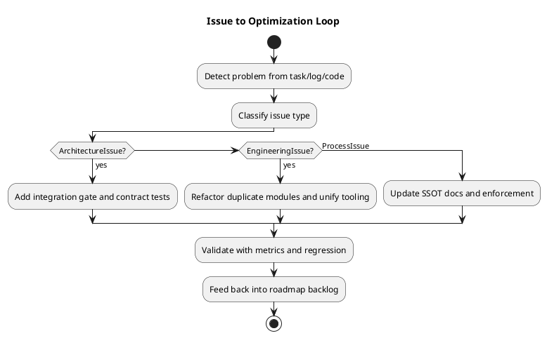

# Markus 产品全景文档（2026-03）

## 1. 文档目标与证据边界

- 本文档用于统一 Markus 当前产品方向、未提交代码归因、阶段路线图与治理策略，作为后续研发排期与评审基线。
- 证据来源：
  - 产品与架构：`docs/PRODUCT.md`、`docs/ARCHITECTURE.md`
  - 任务快照：`docs/task-status-update-20260302.md`
  - 任务运行逻辑：`packages/org-manager/src/task-service.ts`
  - 未提交改动：`git status` + 关键文件阅读（`packages/core/*`、`packages/org-manager/*`、`tools/*`、`docs/agent-development-process/*`）
  - 运行日志佐证：本地服务启动日志中可见任务恢复、状态迁移、task note 写入
- 数据边界说明：
  - 当前环境无法直接使用 `psql` 查询数据库（本机未安装 `psql`），因此“实时任务列表”采用“文档快照 + 服务运行日志”双证据合并。

## 2. 产品愿景与北极星

- Markus 的核心定位是“数字员工平台”，不是“单轮 AI 工具集合”。
- 目标状态：
  - Agent 可入职、有边界、有记忆、可协作、能主动推进任务。
  - 所有有意义的工作绑定 Task，并在组织内可追踪、可复盘、可审计。
  - OSS 与 Cloud 双层演进：OSS 保持易部署与可扩展，Cloud 叠加多租户与企业能力。
- 北极星指标（建议落地为季度 KPI）：
  - 任务闭环效率：`Task in_progress -> completed` 中位时长
  - 协作效率：跨 Agent 任务委派成功率、阻塞任务平均恢复时长
  - 交付质量：缺陷率、回滚率、评审一次通过率
  - 平台稳定性：SSE 成功率、长任务流式连接稳定度、心跳任务成功率

## 3. 当前任务全景（completed / active）

### 3.1 已完成与已终止（文档快照）

- `completed`
  - `tsk_00ac6ff1084f345ad1c360dd`：设计 OpenClaw 生态接入方案
- `cancelled`
  - `tsk_cccdac169e410c4b6ee0d110`：Build new landing page（描述为空，已取消）

### 3.2 活跃任务（文档快照 + 运行日志合并）

- 快照中的 in_progress（示例，含负责人）：
  - `tsk_53f6cc7809195f8c1bd9ed70`：OpenClaw 生态集成（DevBot）
  - `tsk_693021c3c6737df4bd1511ff`：流式响应增强（Zuck）
  - `tsk_2d733fcf938fa946fd031571`：Agent 标准开发流程（Bob）
  - `tsk_5b8d83da30e1d15f71da9577`：增强 OpenClaw 心跳机制（DevBot）
  - `tsk_adf3271c3c6a8b012968ab5e`：外部 Agent 集成（DevBot）
- 日志可验证的状态迁移（服务启动恢复阶段）：
  - 系统检测并恢复 in_progress 任务；无指派的任务被重置为 pending（符合 `task-service.ts` 的恢复策略）
  - `tsk_53f6cc7809195f8c1bd9ed70`、`tsk_693021c3c6737df4bd1511ff` 被恢复并继续执行
  - `tsk_d075d1f1838ed0ed891db514`、`tsk_adf3271c3c6a8b012968ab5e` 等出现后续 `in_progress` 更新与 note 写入

### 3.3 当前任务系统结论

- 可用能力：
  - 状态流转、自动恢复、未指派 in_progress 自动回退 pending、父子任务完成联动
- 当前缺口：
  - 缺少可直接查询“当前真实状态”的统一导出报表（CLI/API 运营视图）
  - 文档快照与运行时状态有时间差，容易引起“任务认知分叉”

## 4. 未提交代码 -> 任务主题 -> Agent 工作映射

### 4.1 代码分组映射

- A. OpenClaw / 外部 Agent 生态（主要对应 DevBot）
  - `packages/core/src/agent-enhanced.ts`
  - `packages/core/src/agent-manager-enhanced.ts`
  - `packages/core/src/heartbeat-enhanced.ts`
  - `packages/core/src/openclaw-heartbeat-scheduler-enhanced.ts`
  - `packages/core/src/external-agent-gateway.ts`
  - `packages/core/src/skill-translator.ts`
  - 关联任务：`tsk_53f6cc7809195f8c1bd9ed70`、`tsk_adf3271c3c6a8b012968ab5e`
- B. SSE 流式增强（主要对应 Zuck）
  - `packages/org-manager/src/sse-handler.ts`
  - `packages/org-manager/src/api-server.ts`
  - `packages/org-manager/test-sse-simple.cjs` 及多份 `sse-*` 测试脚本
  - 关联任务：`tsk_693021c3c6737df4bd1511ff`、`tsk_d075d1f1838ed0ed891db514`
- C. Agent 开发流程工具链（DevBot + Linus + Bob 协作）
  - `tools/git-worktree/*`
  - `tools/code-review/*`
  - `tools/quality-check/*`
  - `docs/agent-development-process/*`
  - 关联任务：`tsk_2d733fcf938fa946fd031571` 及其 5 个子任务

### 4.2 完成度与风险判断

- A 组（OpenClaw 生态）完成度：中（约 65-75%）
  - 优点：
    - 已有解析器、心跳增强、外部网关、技能翻译的主干代码
  - 高风险：
    - `external-agent-gateway.ts` 对 `parseFullConfig()` 的解构字段与解析器返回字段不一致  
      （解析器返回 `openClawConfig`，网关解构为 `openClawRole`）
    - 新增强化链路未纳入 `packages/core/src/index.ts` 导出，集成可达性不足
    - `EnhancedAgent` 与现有 `Agent` 主执行路径尚未形成完整替代闭环
- B 组（SSE 增强）完成度：中高（约 80-85%）
  - 优点：
    - 针对 `message_end`、进度事件和缓冲刷新的补强方向正确
  - 风险：
    - 使用 `as any` 强刷 buffer，提示接口设计不完整
    - 测试脚本数量过多且重复，维护和回归成本高
    - 新增 `/api/test-sse` 端点偏调试用途，需明确环境隔离策略
- C 组（流程工具链）完成度：中（约 60-75%）
  - 优点：
    - 覆盖了 Worktree、评审、质量检查的三件套
  - 风险：
    - `tools/git-worktree` 出现两套 manager/命令路径并存，职责重复
    - `tools/code-review` 多处 TODO/占位实现（如 init 保存配置）
    - `tools/quality-check` 里大量 `find/grep/cat` 与脆弱命令拼接，monorepo 适配不足

## 5. Agent 产出质量审查（可用 / 不可用）

### 5.1 可直接复用

- 架构方向可用：
  - 以 Task 为中心的工作闭环
  - 心跳与任务系统联动
  - 标准开发流程“工作隔离 + 质量门禁 + 评审闭环”框架
- 工具层可复用模块：
  - `tools/git-worktree` 的命令模型（create/list/remove/prune/check/update）
  - `tools/code-review` 的服务拆分思路（assignment/check/manager）
  - `tools/quality-check` 的 checker manager 结构

### 5.2 暂不可直接上线（需重构）

- OpenClaw 网关链路
  - 字段命名错误会导致连接信息丢失，属于功能正确性问题
  - 鉴权 token 为内存+明文风格，不适合生产
  - `orgId: 'external'` 硬编码，不满足多组织隔离
- 流程文档
  - 多份文档重复且口径冲突（命名规范、命令规范、Node 版本要求）
  - `agent-development-workflow.md` 出现重复拼接段，影响可读性与权威性
- 质量检查与评审工具
  - 规则误报率可能高（关键字扫描策略粗糙）
  - 强依赖 shell 文本解析，跨平台与大仓库稳定性不足

### 5.3 问题根因

- 架构层：
  - 新增能力没有经过“接入主链路、导出、回归测试”的统一门禁
- 工程层：
  - 以“脚本可跑”为目标，缺少“可维护、可扩展、可观测”约束
- 流程层：
  - 文档生产多源并行，缺少“单一事实源（SSOT）”和版本治理

## 6. 开源复用 vs 自建决策矩阵

### 6.1 优先复用开源

- 代码评审自动化
  - 候选：PR-Agent / reviewdog / Danger
  - 结论：复用为主，自建只做 Markus 任务上下文桥接
- SSE 客户端与流解析
  - 候选：`@microsoft/fetch-event-source`、`eventsource-parser`
  - 结论：复用成熟协议实现，减少边界 bug
- Git 操作封装
  - 候选：`simple-git`（命令封装层）
  - 结论：复用底层 git 执行封装，自建保留 Markus 命名规范和配置持久化

### 6.2 必须自建（业务护城河）

- 任务中心语义层
  - Task 生命周期、组织归属、Agent 协作协议、运营指标定义
- OpenClaw 配置解析到 Markus 角色映射
  - 与本平台角色模板、心跳任务、工具权限模型深度耦合
- 外部 Agent 接入网关
  - 组织隔离、鉴权策略、任务归属与审计要求需按 Markus 业务定制

### 6.3 协议策略

- MCP：继续作为“工具接入标准层”
- A2A：采用标准化协议承载“Agent 间协作语义”
- 决策：MCP + A2A 并存，不互相替代

## 7. 产品大图问题（Big Picture）

- 产品层问题
  - 愿景清晰，但“可运营化指标体系”尚不完整
  - 路线图中 P1/P2/P3 与 backlog 优先级存在局部冲突
- 架构层问题
  - 新能力接入主链路门禁不足，导致“代码存在但系统不可达”
  - 外部接入能力缺少统一安全模型（鉴权、租户、审计）
- 工程层问题
  - 工具链出现重复实现与职责漂移
  - 文档作为流程基础设施，但版本治理薄弱
- 组织层问题
  - Agent 并行产出缺少统一验收标准，导致“可演示但难上线”

## 8. 优化方案（分层）

- 平台治理（P0）
  - 建立“接入主链路门禁”：
    - 未导出 / 未集成 / 未测试的模块不能进入主发布候选
  - 建立“文档 SSOT”：
    - 统一流程入口文档，其他文档只做引用不重复定义
- OpenClaw 生态（P1）
  - 修正字段与类型契约，补全网关鉴权与 orgId 策略
  - 为外部 Agent 接入增加 e2e 回归测试
- 流式体验（P1）
  - SSE 协议层引入标准库，统一事件 schema
  - 合并测试脚本为“冒烟/性能/稳定性”三类
- 工具链产品化（P1-P2）
  - `git-worktree` 收敛为单实现路径
  - `code-review` 与 `quality-check` 去占位、去脆弱 shell 逻辑，改为可配置规则引擎

## 9. 路线图、阶段目标与里程碑

### 阶段总览（nested bullets）

- Phase 0（1 周）：稳定性止血
  - 目标
    - 修复高风险正确性问题，建立最小可发布基线
  - 里程碑
    - OpenClaw 网关字段契约修复完成
    - SSE 事件流端到端冒烟通过
  - 主要任务
    - 修复 `parseFullConfig` 字段解构问题
    - 增加网关鉴权与 orgId 基础策略
    - 梳理并收敛 SSE 调试端点策略

- Phase 1（2-3 周）：主链路打通
  - 目标
    - OpenClaw 外部 Agent 接入可灰度上线
    - 开发流程工具链可在真实任务中闭环使用
  - 里程碑
    - Enhanced 能力正式纳入 core 导出与主流程
    - Worktree / Review / Quality 三工具联调通过
  - 主要任务
    - 增加集成测试：外部接入 -> 任务分配 -> 回传状态
    - 去除工具链重复实现
    - 统一质量检查命令与配置入口

- Phase 2（3-4 周）：工程化与可运营
  - 目标
    - 形成指标化运维面板与治理规则
  - 里程碑
    - 任务效率与稳定性指标上线
    - 文档体系完成 SSOT 收敛
  - 主要任务
    - 建立任务看板 KPI 报表
    - 评审自动化接入开源框架并定制 Markus 规则
    - 文档去重与冲突消解

- Phase 3（持续）：生态扩展
  - 目标
    - 推进 A2A 结构化协作与跨系统可组合能力
  - 里程碑
    - MCP + A2A 协作标准落地
    - 外部通信与 GUI 自动化形成稳定插件化能力
  - 主要任务
    - 结构化 A2A 消息协议落地
    - GUI 自动化与任务系统深度打通

### 阶段验收指标（建议）

- Phase 0
  - P0 缺陷关闭率 >= 90%
  - OpenClaw 接入主流程阻断问题清零
- Phase 1
  - 外部 Agent 任务成功执行率 >= 85%
  - 工具链在 3 个真实任务中的完整闭环率 >= 80%
- Phase 2
  - 评审一次通过率提升到 >= 90%
  - 流式连接失败率下降 >= 40%
- Phase 3
  - 跨 Agent 协作任务完成率持续提升
  - 平台新增能力接入周期缩短 >= 30%

## 10. PlantUML 图

### 10.1 能力与问题地图

### 10.2 路线图甘特图

### 10.3 问题闭环图

## 11. 结论与执行建议

- 当前未提交代码体现了正确的大方向，但整体处于“功能雏形期”，不能直接按“生产可用”判断。
- 最优策略不是全盘推翻，而是“保留方向、重做主链路门禁、收敛重复实现、复用成熟开源底座”。
- 近期优先级建议：
  - 先修正确性与接入问题（OpenClaw 网关 + SSE 协议一致性）
  - 再做工具链产品化（单路径、可配置、可审计）
  - 最后扩展生态能力（A2A、GUI、外部适配器）
