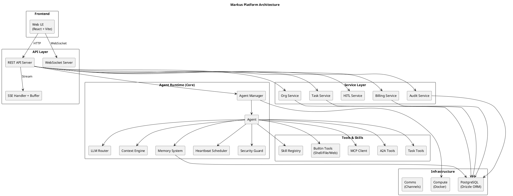
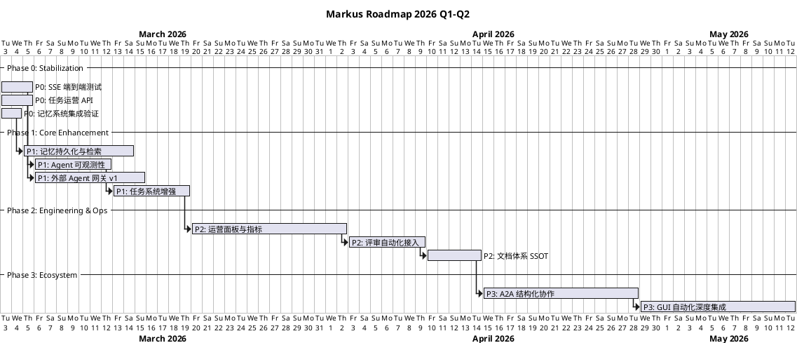

# Markus 产品全景与路线图（2026-03）

## 1. 文档目标

本文档是 Markus 产品的统一战略基线，覆盖产品愿景、当前架构状态、未提交代码治理结论、技术路线图与阶段交付物。所有研发排期与评审以此为基准。

## 2. 产品愿景与北极星

### 2.1 核心定位

Markus 是一个 **AI 数字员工平台**（AI Digital Employee Platform），而非单轮 AI 工具集合。

核心差异化：
- Agent 拥有**组织身份**：入职到组织、归属团队、有角色与权限边界
- Agent 拥有**持续记忆**：短期/中期/长期记忆，跨对话持久化
- Agent 的工作**以 Task 为中心**：所有有意义的工作绑定 Task，可追踪、可复盘、可审计
- Agent 可**主动推进任务**：通过心跳调度自主发现并执行工作
- Agent 可**协作**：Agent 间消息传递、任务委派、Manager-Worker 层级

### 2.2 目标状态

- OSS 层：单组织部署，功能完整，易上手，可扩展
- Cloud 层：多租户、企业能力、计费、审计（后续演进）

### 2.3 北极星指标

| 指标 | 定义 | 目标 |
|------|------|------|
| 任务闭环效率 | `in_progress → completed` 中位时长 | 持续下降 |
| 协作效率 | 跨 Agent 任务委派成功率 | ≥ 85% |
| 交付质量 | 缺陷率 + 回滚率 | 持续下降 |
| 平台稳定性 | SSE 连接成功率 + 心跳任务成功率 | ≥ 99% |
| 记忆有效性 | Agent 引用历史上下文的准确率 | ≥ 80% |

## 3. 当前架构全景

### 3.1 包结构

```
markus/
├── packages/
│   ├── core/          # Agent 运行时：Agent、LLM Router、Memory、Tools、Skills
│   ├── org-manager/   # 组织服务层：API Server、WebSocket、SSE、Task/Org/Billing/HITL/Audit
│   ├── shared/        # 共享类型与工具函数
│   ├── storage/       # 数据持久化（Drizzle ORM → PostgreSQL）
│   ├── web-ui/        # React 前端（Dashboard、Chat、TaskBoard、AgentProfile）
│   ├── a2a/           # Agent-to-Agent 协议与类型
│   ├── compute/       # 计算环境管理（Docker）
│   ├── comms/         # 通信渠道集成
│   ├── cli/           # CLI 入口
│   └── gui/           # GUI 自动化工具
└── docs/              # 产品与流程文档
```

### 3.2 核心能力矩阵

| 能力 | 位置 | 成熟度 | 说明 |
|------|------|--------|------|
| Agent 生命周期管理 | `core/agent-manager.ts` | ★★★★ | 创建、启动、停止、角色加载、工具注册 |
| LLM 多模型路由 | `core/llm/router.ts` | ★★★★ | Anthropic/OpenAI，复杂度感知路由，健康度降级 |
| 对话与工具执行 | `core/agent.ts` | ★★★★ | 多轮对话、工具调用、流式响应 |
| 记忆系统 | `core/memory/store.ts` + `enhanced-memory-system.ts` | ★★★ | 基础持久化存在，增强记忆（短/中/长期）已实现但集成度有限 |
| 任务系统 | `org-manager/task-service.ts` | ★★★★ | CRUD、状态流转、自动恢复、父子任务 |
| SSE 流式响应 | `org-manager/sse-handler.ts` + `sse-buffer.ts` | ★★★ | 文本流、进度事件、工具事件；缓冲与关闭安全已修复 |
| REST API | `org-manager/api-server.ts` | ★★★★ | 完整的组织/Agent/任务/聊天/计费 API |
| WebSocket 实时推送 | `org-manager/ws-server.ts` | ★★★ | 基础实时事件广播 |
| Agent 间通信 | `core/tools/a2a.ts` | ★★★ | 消息传递、同事列表、结构化协作 |
| Manager-Worker 委派 | `core/tools/manager.ts` | ★★★ | 团队状态、任务创建与委派 |
| 心跳调度 | `core/heartbeat.ts` | ★★★ | Cron/Interval，OpenClaw 格式支持 |
| 安全守卫 | `core/security.ts` | ★★★ | Shell 命令与文件路径校验 |
| MCP 工具集成 | `core/tools/mcp-client.ts` | ★★★ | 标准 MCP 协议工具接入 |
| Skill 注册与发现 | `core/skills/` | ★★ | Git、Code Analysis、Browser、GUI、飞书 Skill |
| Web UI | `web-ui/` | ★★★ | Dashboard、Chat、TaskBoard、AgentProfile、SkillStore |
| 组织与团队管理 | `org-manager/org-service.ts` | ★★★★ | 组织、团队、人员、角色 |
| 审计日志 | `org-manager/audit-service.ts` | ★★★ | 事件日志、Token 用量 |
| 计费服务 | `org-manager/billing-service.ts` | ★★ | 用量追踪、API Key、Plan |

### 3.3 系统架构图



## 4. 未提交代码治理（已完成）

### 4.1 处置结果

对 Agent 自行生成的未提交代码进行了全面审查，分类处置如下：

**已保留并提交（commit `85f69d6`）：**

| 文件 | 改动 | 保留理由 |
|------|------|----------|
| `core/llm/router.ts` | 新增 `defaultProviderName` getter | 合理封装，消除外部硬编码 |
| `core/agent-manager.ts` | 使用 `llmRouter.defaultProviderName` | 消除对 `'anthropic'` 的硬编码耦合 |
| `org-manager/sse-handler.ts` | 新增 `message_end` 事件处理 + flush | SSE 流完整性改进 |
| `org-manager/sse-buffer.ts` | close() 安全检查 + 修复换行 bug | 防止 `ERR_HTTP_HEADERS_SENT`，修正 SSE 协议 |

**已丢弃（共计 ~8000 行代码）：**

| 类别 | 文件数 | 丢弃理由 |
|------|--------|----------|
| OpenClaw 集成链路 | 6 | 与现有 Agent 类体系重复，字段契约不一致，架构方向未确定 |
| SSE 调试脚本 | 8 | 临时脚本，应用正式测试框架替代 |
| 工具链（git-worktree, code-review, quality-check） | ~40 | 非核心功能，实现质量不足（重复路径、脆弱 shell 拼接、占位代码） |
| api-server test-sse 端点 | 1 | 调试端点，有已知 bug |
| 任务状态快照文档 | 1 | 一次性报告，非持久文档 |

### 4.2 Agent 代码质量问题根因分析

| 问题层 | 表现 | 根因 |
|--------|------|------|
| 架构层 | 新增能力未纳入 `index.ts` 导出，"代码存在但系统不可达" | 缺少接入主链路门禁 |
| 工程层 | 以"脚本可跑"为目标，缺少可维护性约束 | Agent 没有工程质量标准作为 prompt 约束 |
| 协作层 | 多 Agent 并行产出重复实现 | 缺少共享设计文档和任务依赖管理 |
| 测试层 | 临时脚本充当测试，无回归保障 | 缺少测试框架集成标准 |

### 4.3 改进措施

- 建立 **主链路门禁**：所有新模块必须通过 `index.ts` 导出 + 至少一个集成测试
- Agent Prompt 中增加 **工程质量约束**：禁止 `as any`、要求 Vitest 测试、禁止临时脚本
- 建立 **设计文档前置** 流程：复杂功能先写设计，经人工审批后再开发

## 5. 开源复用 vs 自建决策

### 5.1 复用开源

| 功能 | 候选方案 | 决策 |
|------|----------|------|
| SSE 客户端解析 | `eventsource-parser`、`@microsoft/fetch-event-source` | 复用，减少协议层 bug |
| 代码评审自动化 | `reviewdog`、`PR-Agent` | 复用为主，仅桥接 Markus 任务上下文 |
| Git 操作封装 | `simple-git` | 复用底层执行，自建上层配置规范 |
| 定时任务调度 | `node-cron`（已使用） | 继续使用 |
| 向量检索（记忆） | `pgvector` / `chromadb` | 复用，避免自建向量引擎 |

### 5.2 必须自建（业务护城河）

| 功能 | 原因 |
|------|------|
| 任务中心语义层 | Task 生命周期、组织归属、Agent 协作协议深度绑定业务 |
| Agent 角色与权限模型 | 角色模板、心跳任务、工具权限与平台角色模型紧密耦合 |
| 外部 Agent 接入网关 | 组织隔离、鉴权策略、任务归属需按业务定制 |
| Context Engine | 系统 Prompt 构建逻辑是平台核心竞争力 |

### 5.3 协议策略

- **MCP**：作为 Agent → 外部工具 的标准接入层（已支持）
- **A2A**：作为 Agent ↔ Agent 的结构化协作协议（已有基础类型，待完善语义）
- 两者并存互补，不互相替代

## 6. 路线图

### 6.1 阶段总览



### 6.2 Phase 0 — 稳定性止血（1 周）

**目标**：修复已知问题，建立最小可发布基线。

| 任务 | 交付物 | 验收标准 |
|------|--------|----------|
| SSE 端到端测试 | `packages/org-manager/src/__tests__/sse.test.ts` | Vitest 测试覆盖：连接建立、文本流、进度事件、工具事件、完成事件、异常断连 |
| 任务运营 API | `/api/tasks/dashboard` 端点 | 返回按状态分组的任务统计 + 活跃 Agent 列表，响应 < 200ms |
| 记忆系统集成验证 | 验证 `EnhancedMemorySystem` 在主链路中的可用性 | Agent 对话中可引用前次对话内容 |

### 6.3 Phase 1 — 核心能力增强（3-4 周）

**目标**：让 Agent 真正拥有持续记忆、可观测运行状态、可接入外部系统。

#### P1.1 记忆持久化与检索

- **现状**：`EnhancedMemorySystem` 已实现短/中/长期记忆层，但仅内存存储
- **交付物**：
  - 记忆持久化到 PostgreSQL（`@markus/storage` 新增 memory 表）
  - 基于关键词/语义的记忆检索（优先使用 `pg_trgm` 全文搜索，后续可升级 pgvector）
  - 记忆自动升级策略：短期 → 中期（频次阈值）→ 长期（显式标记）
- **验收**：Agent 重启后能从 DB 恢复记忆，对话中引用 3 天前的上下文

#### P1.2 Agent 可观测性

- **交付物**：
  - `/api/agents/:id/metrics` 端点：Token 用量、任务完成率、平均响应时间、活跃任务
  - Agent 健康度评分算法：综合心跳成功率、任务完成率、错误率
  - 前端 AgentProfile 页面集成指标展示
- **验收**：Web UI 可查看每个 Agent 的健康度分数和历史趋势

#### P1.3 外部 Agent 接入网关 v1

- **现状**：概念验证代码已丢弃（字段不一致、无真实鉴权），需重新实现
- **交付物**：
  - `packages/core/src/external-gateway.ts`：连接管理、JWT 鉴权、消息路由
  - 支持 OpenClaw 配置格式 → Markus 角色模板自动映射
  - 组织隔离（外部 Agent 必须归属到具体 orgId）
  - 集成测试：注册 → 认证 → 发送任务 → 接收状态 → 断连清理
- **验收**：外部 Agent 通过 API 注册并完成一个任务的完整生命周期

#### P1.4 任务系统增强

- **交付物**：
  - 子任务依赖关系（blocked_by 字段）
  - 任务超时检测与自动告警
  - 任务完成时自动触发 webhook / 事件通知
- **验收**：父任务在所有子任务完成后自动流转，阻塞任务被正确标记

### 6.4 Phase 2 — 工程化与可运营（3-4 周）

**目标**：形成指标化运维面板与质量治理规则。

| 任务 | 说明 |
|------|------|
| 运营面板与指标 | Web UI 新增运营 Dashboard：任务看板 KPI、Agent 效率排行、系统健康度 |
| 评审自动化接入 | 集成 reviewdog/PR-Agent，桥接 Markus 任务上下文 |
| 文档体系 SSOT | 统一流程入口文档，消除重复定义与口径冲突 |
| CI/CD 质量门禁 | TypeScript 严格模式、Vitest 覆盖率门槛、ESLint 规则统一 |

### 6.5 Phase 3 — 生态扩展（持续）

**目标**：推进 A2A 结构化协作与跨系统能力。

| 任务 | 说明 |
|------|------|
| A2A 结构化协作 | 结构化消息协议：请求/响应/通知/协商，超时与重试机制 |
| GUI 自动化深度集成 | 截图 → 元素识别 → 操作执行闭环，与任务系统打通 |
| Skill Store 生态 | 第三方 Skill 注册、发现、安装机制 |
| 多 LLM Provider 扩展 | DeepSeek、Gemini、本地模型适配 |

### 6.6 阶段验收指标

| 阶段 | 指标 | 目标值 |
|------|------|--------|
| Phase 0 | SSE 端到端测试通过率 | 100% |
| Phase 0 | P0 缺陷关闭率 | ≥ 95% |
| Phase 1 | Agent 记忆跨会话引用成功率 | ≥ 80% |
| Phase 1 | 外部 Agent 任务完整生命周期成功率 | ≥ 85% |
| Phase 2 | 评审一次通过率 | ≥ 90% |
| Phase 2 | 流式连接失败率下降 | ≥ 50% |
| Phase 3 | A2A 跨 Agent 协作任务完成率 | 持续提升 |

## 7. Phase 1 开发详细设计

### 7.1 记忆持久化数据模型

```sql
CREATE TABLE agent_memories (
  id TEXT PRIMARY KEY,
  agent_id TEXT NOT NULL REFERENCES agents(id),
  org_id TEXT NOT NULL,
  tier TEXT NOT NULL CHECK (tier IN ('short', 'medium', 'long')),
  category TEXT NOT NULL,       -- 'fact', 'preference', 'skill', 'episode'
  content TEXT NOT NULL,
  metadata JSONB DEFAULT '{}',
  importance REAL DEFAULT 0.5,  -- 0.0 ~ 1.0
  access_count INTEGER DEFAULT 0,
  last_accessed_at TIMESTAMPTZ,
  promoted_at TIMESTAMPTZ,      -- tier 升级时间
  created_at TIMESTAMPTZ DEFAULT NOW(),
  updated_at TIMESTAMPTZ DEFAULT NOW()
);

CREATE INDEX idx_memories_agent_tier ON agent_memories(agent_id, tier);
CREATE INDEX idx_memories_content_trgm ON agent_memories USING gin(content gin_trgm_ops);
```

### 7.2 外部 Agent 网关接口设计

```typescript
// POST /api/gateway/register
interface RegisterRequest {
  agentId: string;
  agentName: string;
  orgId: string;
  openClawConfig?: string;  // OpenClaw ROLE.md format
  capabilities?: string[];
}

// POST /api/gateway/auth
interface AuthRequest {
  agentId: string;
  orgId: string;
  secret: string;  // org-level API key
}
interface AuthResponse {
  token: string;    // JWT, expires in 24h
  agentId: string;
  markusAgentId: string;
}

// POST /api/gateway/message (requires Bearer token)
interface MessageRequest {
  type: 'task' | 'status' | 'heartbeat';
  content: string;
  metadata?: Record<string, unknown>;
}

// GET /api/gateway/status (requires Bearer token)
interface StatusResponse {
  connected: boolean;
  assignedTasks: TaskSummary[];
  lastHeartbeat: string;
}
```

### 7.3 Agent 可观测性指标

```typescript
interface AgentMetrics {
  agentId: string;
  period: '1h' | '24h' | '7d';

  tokenUsage: {
    input: number;
    output: number;
    cost: number;
  };

  taskMetrics: {
    completed: number;
    failed: number;
    averageCompletionTimeMs: number;
  };

  healthScore: number;  // 0-100, 综合评分
  heartbeatSuccessRate: number;
  errorRate: number;
  averageResponseTimeMs: number;
}
```

## 8. 风险管理

| 风险 | 影响 | 缓解措施 |
|------|------|----------|
| 记忆系统数据量增长导致查询变慢 | Agent 响应延迟 | 分级存储 + TTL 清理策略 + 索引优化 |
| 外部 Agent 接入带来安全风险 | 数据泄露 / 越权 | JWT 鉴权 + 组织隔离 + 操作审计 |
| LLM 提供商 API 不稳定 | Agent 不可用 | 多 Provider 降级路由（已实现） |
| Agent 并行工作产生冲突 | 代码/数据冲突 | 任务锁 + 资源隔离 + 冲突检测 |

## 9. 结论与执行建议

当前 Markus 已具备完整的 Agent 运行时、任务系统、组织管理和 Web UI 基础。经过代码治理，工作区干净、方向明确。

**近期优先级（Phase 0 + Phase 1）：**

1. **稳定性优先**：SSE 测试覆盖、任务运营可视化
2. **记忆是核心差异化**：没有持久化记忆的 Agent 只是 ChatBot，有记忆才是"数字员工"
3. **可观测性驱动改进**：没有指标就无法持续优化
4. **外部接入打开生态**：网关是连接更多 Agent 能力的入口

**执行原则：**

- 每个新模块必须通过 `index.ts` 导出 + Vitest 集成测试
- 复用开源底座，自建业务护城河
- 先跑通端到端再优化性能
- 文档与代码同步更新
